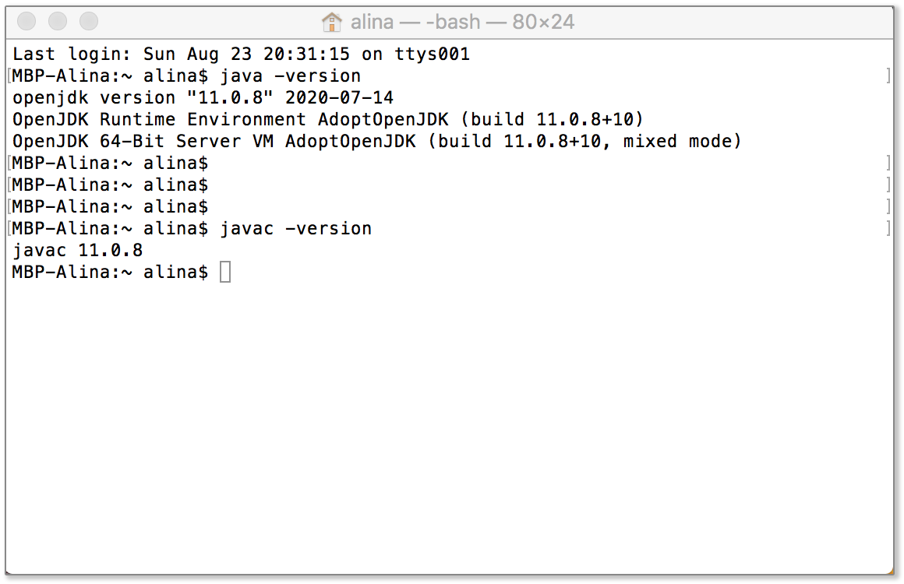

# Lesson 0: How to set up the tools you'll need for the course

## Java 

We use Java 11+. In the command-line terminal, check that you have an installed JDK using the following commands: 
```
java -version
javac -version
```


If you need to install the JDK (or a new version), follow [these instructions](https://adoptopenjdk.net/releases.html).

## IntelliJ Idea

We use the IntelliJ Idea (Community Edition) as an IDE (Integrated Development Environment).

With it, we write code, compile and run it. On top of that, we also use it to integrate with Git (as described in the next section).

To install IntelliJ, download it in the [following link](https://www.jetbrains.com/idea/download), choosing the appropriate version for your operating system.

To learn more about Intellij Idea (e.g. shortcuts, plugins, etc.), here are [some resources](https://www.jetbrains.com/idea/resources/).

## Git

Git is a tool to handle different versions of your code. Please install it following the [reference manual](https://git-scm.com/book/en/v2/Getting-Started-Installing-Git)

_Git comes with a command-line tool, and there are plenty of other free visual tools out there, but none of them are required for this course (the integration that Intellij Idea Community Edition provides by default is enough)._