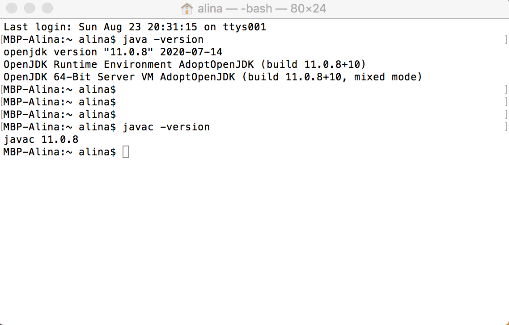

# Lesson 1: Introduction to Programming with Java

## Goals
* Getting to know each other
* Get familiar with schedule, attendance, tools
* Course introduction
* Check required software (Java & Intellij Idea)
* Do some basic Java exercises 🤩

### General info
* 📓 Course certificate only after minimum 80% attendance
* 💨 We don’t show up late to class (and inform otherwise)
* 🏝 We take a 10 minutes break in the middle of the class
* 🕺🏻 We are here for you! Always ask questions if something is not clear.
* 🚀 Never forget the feedback!
* 🕸 [Web](https://redi-school.github.io/intermediate-java), [Previous Semesters](https://redi-j2.netlify.com)
* 🐦 Slack: #21f_programming_java
* 🎓 We will have a Project at the end of the course!

### Content

We shall aim to cover the following topics over the course of the semester. However, it is
important to note that this is not set in stone. Depending on the progress of the class as a whole,
we may cover a bit more or a bit less. It is nevertheless most important that we work and progress
as a group whilst helping one another grow.

* The Java language
* Git & Github
* Data structures
* Object Oriented Programming
* Exceptions
* Libraries
* Build Tools
* Unit Testing 
* File IO

## Let's check tools

### Java 

We use Java 11+. In the terminal/command line check that you have an installed jdk. 

To install jdk [follow instructions](https://adoptopenjdk.net/releases.html).

-> java -version


## Git

Git is a tool to handle different versions of your code. Please [install it following the reference manual](https://git-scm.com/book/en/v2/Getting-Started-Installing-Git)

### Intellij Idea
We use only functionality of Intellij Idea Community Edition. Please [download it in the following link, choosing the appropriate version for your operating system](https://www.jetbrains.com/idea/download).
To learn more about [Intellij Idea, here are some resources](https://www.jetbrains.com/idea/resources/)

You can find there short cuts, debugging tutorials, integration with verious version control systems (like Git)

## Java Basics Recap
```java
package com.redi.j2;

public class Main {

    public static void main(String[] args) {
        System.out.println("Hello World");

        String name = "Memet";
        String profession = "skydiver";
        int age = 40;
        boolean smoking = false;

        coolOrNotCool(profession);

        for (int i = 0; i < 10; i++) {
            System.out.println("hey " + i);
        }
    }

    private static void coolOrNotCool(String profession) {
        if (profession.equals("skydiver")) {
            System.out.println("Cool");
        } else {
            System.out.println("Not cool");
        }
    }
}
```

## [GitHub classroom](https://classroom.github.com/a/fKsu9Nib)

We shall be using GitHub classroom for the rest of this semester to organize exercises and 
assignments, so it is important that you have a GitHub account. **If you do not have one, please
create an account right now.**

Please click the link above and follow the instructions in your free time. This assignment
contains a course on the fundamentals of Git and GitHub which will help in understanding how
to leverage Git & GitHub for collaboration between the students and tutors. 

## Exercises and assignment

### [#1 Introduction to github classroom](https://classroom.github.com/a/WPyqVy9W)
### [#2 "Know Thy Tools" - get familiar with git](https://classroom.github.com/a/fKsu9Nib)
### [#3 Warming back up to programming with Java](https://classroom.github.com/a/7vXI9ynd)

## Materials:
- [Intellij Idea. First Java Application Tutorial](https://www.jetbrains.com/help/idea/creating-and-running-your-first-java-application.html)
- [The Java Tutorials (from Oracle)](https://docs.oracle.com/javase/tutorial/)
- [W3Schools Java Tutorial](https://www.w3schools.com/java/)
- [O'Reilly Programming Podcasts](https://www.oreilly.com/topics/oreilly-programming-podcast)
