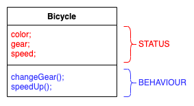
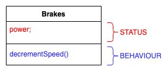
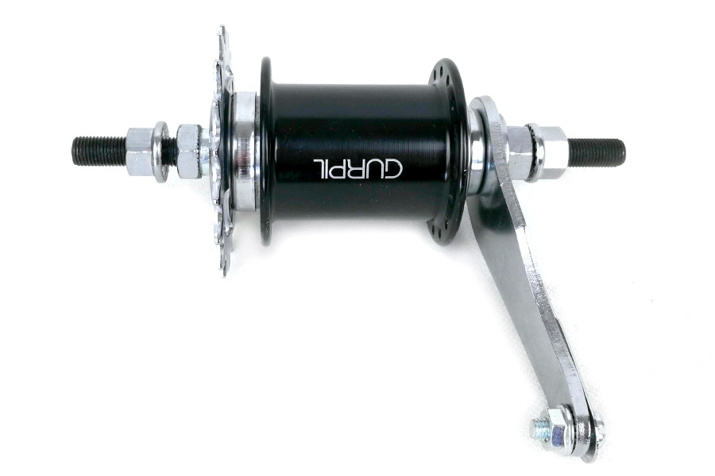

# Lesson 4: OOP - Objects, Classes & Constructor

## Goals

- Know what Object-Oriented Programming is.
- Be able to translate a real-life object to a programming object.
- Be able to create a Java class.
- Be able to instantiate an object of a Java class.
- Understand the difference between a class and an instance.
- Have an overview about class constructors.
- Have an overview about the main concepts of OOP.

## Recap & Assignment check

Let's look into the assignment from lesson 3

## What Is an Object?

An object is a software bundle of related property and behavior. Software objects are often used to model the real-world
objects that you find in everyday life. This lesson explains how property and behavior are represented within an object,
introduces the concept of data encapsulation, and explains the benefits of designing your software in this manner.

Objects are key to understanding object-oriented technology. Look around right now and you'll find many examples of
real-world objects: your dog, your desk, your television set, your bicycle.

Real-world objects share two characteristics: They all have property and behavior. Dogs have property (name, color,
breed, hungry) and behavior (barking, fetching, wagging tail). Bicycles also have property (current gear, current speed)
and behavior (changing gear, applying brakes). Identifying the property and behavior for real-world objects is a great
way to begin thinking in terms of object-oriented programming.

Take a minute right now to observe the real-world objects that are in your immediate area. For each object that you see,
ask yourself two questions: "What possible properties can this object be in?" and "What possible behavior can this
object perform?". Make sure to write down your observations. As you do, you'll notice that real-world objects vary in
complexity; your desktop lamp may have only two possible properties (on and off) and two possible behaviors (turn on,
turn off), but your desktop radio might have additional properties (on, off, current volume, current station) and
behavior (turn on, turn off, increase volume, decrease volume, seek, scan, and tune). You may also notice that some
objects, in turn, will also contain other objects. These real-world observations all translate into the world of
object-oriented programming.


Software objects are conceptually similar to real-world objects: they too consist of property and related behavior. An
object stores its property in fields (variables in some programming languages) and exposes its behavior through
methods (functions in some programming languages). Methods operate on an object's internal property and serve as the primary
mechanism for object-to-object communication. Hiding internal property and requiring all interaction to be performed
through an object's methods is known as data encapsulation — a fundamental principle of object-oriented programming.

### An example: a Bicycle Object

Consider a bicycle, for example:


Any bicycle you see on the street can be represented through an object; its **status** is represented by their **properties**:
- color
- gear
- speed

part of the status does change over time due to object **behaviors**, which are represented by its **methods**:
- changeGear()
- speedUp()

We will represent the bicycle object like this



## What Is a Class?

A class is a blueprint or prototype from which objects are created. This section defines a class that models the
property and behavior of a real-world object. It intentionally focuses on the basics, showing how even a simple class
can cleanly model property and behavior.

In the real world, you'll often find many individual objects of the same kind. There may be thousands of other
bicycles in existence, all of the same make and model. Each bicycle was built from the same set of blueprints and
therefore contains the same components. In object-oriented terms, we say that your bicycle is an instance of the class
of objects known as bicycles. A class is the blueprint from which individual objects are created.

The following Bicycle class is one possible implementation of a bicycle class:

```java
class Bicycle {

    String color = "green";
    int speed = 0;
    int gear = 1;

    void changeGear(int newValue) {
        gear = newValue;
    }

    void speedUp(int increment) {
        speed = speed + increment;
    }

    void printProperties() {
        System.out.println("color:" + speed + "speed:" + speed + " gear:" + gear);
    }
}
```

The syntax of the Java programming language will look new to you, but the design of this class is based on the previous
discussion of bicycle objects. The fields speed, and gear represent the object's property, and the methods (changeGear,
speedUp) define its interaction with the outside world.

## Objects are instances of a class

You may have noticed that the `Bicycle` class does not contain a main method. That's because it's not a complete
application; it's just the blueprint for bicycles that might be used in an application. The responsibility of creating
and using new `Bicycle` objects belongs to some other class in your application.

Here's a `BicycleDemo` class that creates two separate `Bicycle` objects and invokes their methods:

```java
class BicycleDemo {
    public static void main(String[] args) {

        // Create two different 
        // Bicycle objects
        Bicycle greenBike = new Bicycle();
        Bicycle redBike = new Bicycle();

        // Invoke methods on 
        // those objects
        greenBike.speedUp(10);
        greenBike.changeGear(2);
        greenBike.printProperties();

        redBike.color("red");
        redBike.speedUp(10);
        redBike.changeGear(2);
        redBike.speedUp(10);
        redBike.changeGear(3);
        redBike.printProperties();
    }
}

```

The output of this test prints the current speed, and gear for the two bicycles:

```
color:green speed:10 gear:2
color:red speed:20 gear:3
```


## Constructors

A class contains constructors that are invoked to create objects from the class blueprint. Constructor declarations look
like method declarations—except that they use the name of the class and have no return type. For example, `Bicycle` has
the following constructors:

```java
class Bicycle {

    /** Properties */
    String color;
    int speed;
    int gear;

    /** Constructors */
    public Bicycle(String color, int startSpeed, int startGear){
        this.color=color;
        this.gear=startGear;
        this.speed=startSpeed;
    }
    
    public Bicycle(){
        this.color="green";
        this.gear=1;
        this.speed=0;
    }

    /** Methods */
    void changeGear(int newValue) {
        gear = newValue;
    }

    void speedUp(int increment) {
        speed = speed + increment;
    }

    void printProperties() {
        System.out.println("color" + color + "speed:" + speed + " gear:" + gear);
    }
}
```

To create a new `Bicycle` object called `blueBike`, a constructor is called by the new operator:

```java
Bicycle blueBike=new Bicycle("blue",0,8);
```

`Bicycle yourBike = new Bicycle();` invokes the no-argument constructor to create a new `Bicycle` object
called `yourBike`.

```java
Bicycle yourBike=new Bicycle();
yourBike.gear=5;
yourBike.speed=2;
```

Both constructors could have been declared in Bicycle because they have different argument lists. As with methods, the
Java platform differentiates constructors on the basis of the number of arguments in the list and their types. You
cannot write two constructors that have the same number and type of arguments for the same class, because the platform
would not be able to tell them apart. Doing so causes a compile-time error.

You don't have to provide any constructors for your class, but you must be careful when doing this. The compiler
automatically provides a no-argument, default constructor for any class without constructors.

# OOP benefits
In contrast to other styles of programming (e.g procedural, functional, and so on) Object Oriented Programming assumes
that everything can be represented as an object. Interaction between defined objects defines the applications.

We will use the Bicycle example to introduce the benefits of this approach:

1. **Modularity**: The source code for an object can be written and maintained independently of the source code for other
   objects. Once created, an object can be easily passed around inside the system.

   Given that everything is representable as an object, object can be compounded of other objects. We can identify an 
object for our bicycle brakes

    

   This is then the Brakes Class
   ``` java
   class Brakes {
   
       int power = 2;
   
       int decrementSpeed(int initialSpeed) {
           int finalSpeed = initialSpeed - power;
           return finalSpeed;
       }
   }
   ```

   so we can enhance our Bicycle Class using the Brakes Class:
    ``` java
    class Bicycle {
    
        /** Properties */
        String color;
        int speed;
        int gear;
        Brakes brakes;
    
        /** Constructors */
        public Bicycle(int color, int startSpeed, int startGear){
            this.color=color
            this.gear=startGear;
            this.speed=startSpeed;
            this.brakes=new Brakes();
        }
        
        public Bicycle(){
                this.color="green";
                this.gear=1;
                this.speed=0;
                this.brakes=new Brakes();
        }
    
        /** Methods */
        void changeGear(int newValue) {
            gear = newValue;
        }
    
        void speedUp(int increment) {
            speed = speed + increment;
        }
       
        void hitBrakes() {
            speed = brakes.decrementSpeed(speed)
        }
    
        void printProperties() {
            System.out.println("color:" + color + "speed:" + speed + " gear:" + gear);
        }
    }
    ```

2. **Information-hiding**: By interacting only with an object's methods, the details of its internal implementation
  remain hidden from the outside world.

    Just imagine our Brakes class to be implemented as follows:
    ``` java
   class Brakes {

       int power = 2;

       int decrementSpeed(int initialSpeed) {
           int finalSpeed = initialSpeed / power; //here we divide speed by the power!
           return finalSpeed;
       }
   }
    ```
   The internal implementation of `decrementSpeed()` changed, but it has no implication to its usage in Bicycle class.

3. **Code re-use**: If an object already exists (perhaps written by another software developer), you can use that object
in your program. This allows specialists to implement/test/debug complex, task-specific objects, which you can then
trust to run in your own code.

    Lots of manufacturers out there have their implementation of Brakes
   
    | V-BRAKES                                                  |                          DISC-BRAKES                          |                          COASTER BRAKES                          | 
    |:-------------------------------------------------------------:|:----------------------------------------------------------------:| :----: |
    |  |  |  | 

    ``` java
    import shimano.VBrakes;
   
    class Bicycle {
    
        /** Properties */
        String color = "green";
        int speed = 0;
        int gear = 1;
        VBrakes brakes;
      
    ...
   }


- **Pluggability** and debugging ease: If a particular object turns out to be problematic, you can simply remove it from
  your application and plug in a different object as its replacement. This is analogous to fixing mechanical problems in
  the real world. If a bolt breaks, you replace it, not the entire machine.

    Which means: if you prefer the disc-Brakes, you can use them

    ``` java
    import brembo.DiscBrakes;
  
    class Bicycle {
    
        /** Properties */
        String color = "green";
        int speed = 0;
        int gear = 1;
        DiscBrakes brakes;
      
    ...
   }

> We will learn more advanced techniques on how to make VBrakes and DiscBrakes interchangeable with no changes in the
> Bicycle class, by using interfaces and/or the `extends` directive.

## [Exercise & Assignment](https://classroom.github.com/a/NVJU1fy8)

Follow the link and download the assignment from GitHub Classroom

## Materials

- [Object-Oriented Programming Concepts by Oracle](https://docs.oracle.com/javase/tutorial/java/concepts/index.html)
- [Providing Constructors for Your Classes](https://docs.oracle.com/javase/tutorial/java/javaOO/constructors.html)
- [OOP: Everything you need to know about Object Oriented Programming](https://medium.com/from-the-scratch/oop-everything-you-need-to-know-about-object-oriented-programming-aee3c18e281b)
- [4 Pillars for Object Oriented Programming](https://www.linkedin.com/pulse/4-pillars-object-oriented-programming-pushkar-kumar/)

