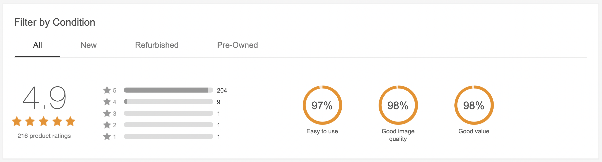

# Lesson 5: OOP - Objects, Classes & Constructor Recap

## Goals

- Recap basic OOP concepts
- Practice creating classes

## [OOP Review Classroom activity](https://classroom.github.com/a/mz9NMDhd)

#### Follow the link, accept and download the assignment from GitHub Classroom

This exercise consists of creating 2 classes to hold Rating and Movie info
Please follow the readme along with the instructor

## [OOP Review Exercise](https://classroom.github.com/a/bRZeqLql)

#### Follow the link, accept and download the assignment from GitHub Classroom

This exercise consists of a series of tasks related to an e-Commerce application (like eBay).

- Create the structure and logic for a `Product` class
- Create structure and logic to "store" and handle instances of the Product class (`ProductRepository`)
- It includes a **Challenge**: to implement a Star Rating mechanism like in the image below

Follow the steps described in the README file and check if your implementation is correct using the corresponding tests.

Good luck and have fun!

## Materials

- [Object-Oriented Programming Concepts by Oracle](https://docs.oracle.com/javase/tutorial/java/concepts/index.html)
- [Providing Constructors for Your Classes](https://docs.oracle.com/javase/tutorial/java/javaOO/constructors.html)
- [OOP: Everything you need to know about Object Oriented Programming](https://medium.com/from-the-scratch/oop-everything-you-need-to-know-about-object-oriented-programming-aee3c18e281b)
- [4 Pillars for Object Oriented Programming](https://www.linkedin.com/pulse/4-pillars-object-oriented-programming-pushkar-kumar/)

