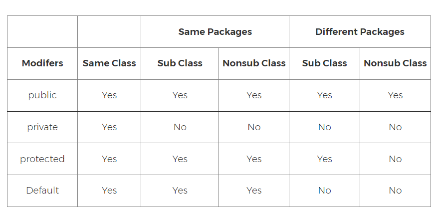

# Lesson 5: OOP - Inheritance and Encapsulation

## Goals

- Check-in
- What is Encapsulation?
- Visibility and access modifiers
- Getters and Setters
- What is Inheritance?
- Why do we need it?
- Have we seen it before?
- Some code Action!

## Check-in
How is everybody doing?

## Encapsulation

### What is it?
In object-oriented programming (OOP), encapsulation refers to the bundling of data with the methods that operate on that data, or the restricting of direct access to some of an object's components.

### What is used for?
Mainly, to hide the values or states inside a class, in order to
- Prevent direct access to them by clients (and avoid violation of internal logic)
- Hide implementation details (increasing usability)
- Promote maintainability (code changes can be made independently)

## Visibility and access modifiers

### Private Access Modifier - Private

- Methods, variables, and constructors that are declared private can only be accessed within the declared class itself.

- Private access modifier is the most restrictive access level. Classes and interfaces cannot be private.

### Public Access Modifier - Public

- A class, method, constructor, interface, etc. declared public can be accessed from any other class(es). Therefore, fields, methods, blocks declared
  inside a public class can be accessed from any class belonging to the Java Universe™.

### Protected Access Modifier - Protect

- Methods, variables, and constructors that are declared private can only be accessed within the declared class itself AND derived classes (inheritance).

### Default Access Modifier (Package Protected) - No Keyword

- Default access modifier means we do not explicitly declare an access modifier for a class, field, method, etc.

- A variable or method declared without any access control modifier is available to any other class in the same package.



## Properties (Attributes) and Accessor Methods (Getters and Setters)
The concept of a "Property" goes beyond having a variable inside a class

- You can have read-only properties
- You can validate what is allowed to be assigned to variables
- You can control the state of a variable (creating this way some Behaviour)
- You can have properties based on pure logic (no "dedicated" variable!)

Getters and Setters are the standard way to define Properties in the Java language (and others)

```java
public class Rectangle {
    
    // private variables
    private float width; // used for the "Width" property
    private float height; // used for the "Height" property
    private boolean readyToDraw; // not used for any property (just internal logic/control)
    
    // simple getter method
    public float getWidth() {
        return width;
    }
    
    // setter with safe-checks
    public void setWidth(float newWidth) {
        if (newWidth < 0) {
            return; // ignores the attempt (could also throw an Exception!)
        }
        this.width = newWidth;
    }
    
    // example of dynamic property
    public float getArea() { // could be named "calculateArea", your call!
        return this.width * this.height;
    }
    
    // example of normal method
    public void draw() {
        if (readyToDraw) {
            // do something with width and height here
        }
    }
}
```

## What is Inheritance?

- Inheritance is one of the key features of OOP that allows us to create a new class from an existing class.
- The new class that is created is known as subclass (also child/derived class), and the existing class from where the child class is derived is known
  as superclass (also parent/base class).
- To inherit from a class, use the `extends` keyword.
- In Java (as well as in other languages), all classes automatically extend the `Object` class

### Let's define, again, a Product class.

```java
public class Product { // extends from Object
    
    // attributes
  
    private float price;
    private String name;
    private String category;

    // getters/setters
  
    public float getPrice() {
        return price;
    }

    protected void setPrice(float price) {
        if (price < 0)
            System.out.println("Are you kidding me?");
        else
            this.price = price;
    }

    public String getName() {
        return name;
    }

    public void setName(String name) {
        this.name = name;
    }

    public String getCategory() {
        return category;
    }

    public void setCategory(String category) {
        this.category = category;
    }

    // methods
    
    @Override // optional annotation (improves readability)
    public String toString() {
        return "Product{" +
               "price=" + price +
               ", name='" + name + '\'' +
               ", category='" + category + '\'' +
               '}';
    }
}
```

### Problem
What if I have many laptops, and I need to make sure that none of them has its price to be less than 100?

#### Without Inheritance (bad)

```java
public class Laptop {

    // duplicated attributes  
    private float price;
    private String name;
    private String category = "Electronics";

    // ... lots of duplicated code here

    public void setPrice(float price) {
        if (price < 100)
            System.out.println("I can't be that cheap");
        else
            this.price = price;
    }

    // ... more duplicated code here

    @Override
    public String toString() {
        return "Product{" +
            "price=" + price +
            ", name='" + name + '\'' +
            ", category='" + category + '\'' +
            '}' + " I'm also a a laptop btw!";
    }
}
```

### Using Inheritance (better)

```java
public class Laptop extends Product {
    
    // already got all properties from Product (price, name and category)

    public Laptop() {
        setCategory("Electronics");
    }

    @Override
    public void setPrice(float price) { // different behaviour from superclass
        if (price < 100) {
            System.out.println("I can't be THAT cheap!!");
        }
        else {
            super.setPrice(price);
        }
    }

    @Override
    public String toString() {
        return super.toString() + " I am also a Laptop btw!";
    }
    
    // Laptop can also extend Product with new methods
    public void setHardDisk(int gigabytes) {
        // ...
    }
}
```

### Think of inheritance as an "is-a" relationship

- In Java, inheritance is an is-a relationship. That is, we use inheritance only if there exists an is-a relationship between two classes. 
  - Laptop **is a** Product
  - Car **is a** Vehicle
  - Orange **is a** Fruit.

## Why do we need it?

- The most important use of inheritance in Java is code reusability. The code that is present in the parent class can be directly used by the child
  class.
- Method overriding is also known as runtime polymorphism. Hence, we can achieve Polymorphism in Java with the help of inheritance.

### Polymorphism x Specialization (Example)

```java
public class Main {
    
    public static void main(String[] args) {
        
        // instantiating some products
        Product p1 = new Product();
        Product p2 = new Laptop(); // Laptop IS A Product, thus this statement is accepted

        // here's the polymorphism
        p1.setPrice(10); // that works
        p2.setPrice(10); // won't work! (too cheap for a Laptop)
      
        // beware of the reference type
        p2.setHardDisk(4); // does not compile (because the reference is for Product)
        if (p2 instanceof Laptop) { // safe-check
            Laptop laptop = (Laptop) p2; // this is called "Casting"
            laptop.setHardDisk(4); // now it compiles
        }
    }
}
```

## Problems with Inheritance

- Is the strongest type of relationship, so it should be avoided unless you are completely sure
  - Strong Coupling, meaning, you won't be able to change it afterwards without a huge refactoring
  - It is not flexible enough to represent exceptions (or new requirements)
- There are better ways of solving the same problems (e.g. Interfaces and/or Composition, which we will see in other classes)

## Another Example

Let's have a look at another example of handy Inheritance: defining geometric shapes.

```java
public class Shape {

    private final String type;
    private final double area;
    private final double perimeter;
    
    public Shape(String type, double area, double perimeter) {
        this.type = type;
        this.area = area;
        this.perimeter = perimeter;
    }

    // Getters for all properties

}
```

Let us say we want to define two specific Shapes: a Rectangle and a Circle. 

If one could do it with inheritance, having Rectangle as a subclass of the Shape class could look like this:

```java

public class Rectangle extends Shape {

    private final double width;
    private final double height;

    public Rectangle(double width, double height) {
        super("RECTANGLE", width * height, 2 * (width + height));
        this.width = width;
        this.height = height;
    }

    // Getters for width and height only, 
}
```

And having Circle as a subclass of the Shape class could look like that:

 ```java
public class Circle extends Shape {

    private final double radius;

    public Circle(double radius) {
        super("CIRCLE", Math.PI * radius * radius, 2 * Math.PI * radius);
        this.radius = radius;
    }

    // A getter for the radius only, since we are inheriting all other getters from the parent class.
}
 ```

The properties `area` and `perimeter` are now `inherited` by the subclasses `Circle` and `Rectangle`.

Now suppose we want to take control of how we print our Shapes, and we simply want to do the following

```java
public class Main {

    public static void main(String[] args) {
        Shape shape1 = new Rectangle(10.0, 10.0);
        Shape shape2 = new Circle(20.0);
    }
    
    public static void print(Shape shape) {
        shape.print();
    }

}
```

The assumption here is that the class `Shape` has the method `print` which we haven't defined. So let's define it.

```java
public class Shape {

    // ...

    public void print() {
        System.out.println("Name: " + type);
        System.out.println("Area: " + area);
        System.out.println("Perimeter: " + perimeter);
    }
}
```

So now we have taken control the printing of our shapes. The method `print` is now inherited by the sub classes `Circle`
and `Rectangle`.

But what if we want to print the extra properties of the `Circle` and `Rectangle`, how do we achieve that? The answer is method overriding. We simple
override the method `print` in each of these classes and do whatever we want there.

For example, we can override `print` in `Rectangle` as follows:

```java
public class Rectangle extends Shape {

    // ...
    
    @Override
    public void print() {
        super.print();
        System.out.println("width: " + width);
        System.out.println("height: " + height);
    }
}
```

And we can override `print` in `Circle` as follows:

```java
public class Circle extends Shape {

    // ...

    @Override
    public void print() {
        System.out.println("Radius: " + radius);
    }
}
```

## Exercises:

### Exercise 1
Based on the `Shape` class, implement the `Square` subclass and use it inside the `main` function.
- What specific property(ies) a Square would have?
- How to calculate the area and perimeter inside the constructor?
- How to override the `print` method?

### Exercise 2
Make a new class `QueueList`, that extends the `ArrayList` class:
- Create a new method called `addToQueue`, that adds an element to the last position of the Queue
  - If the element already exists, it should be removed first, and then put at the end of the Queue 
- Create a new method called `getNextFromQueue`, that removes and returns the first element from the Queue (element at index 0)
  - If the Queue is empty, it should return `null`
- Later, discuss:
  - If you call the normal `add` or `remove` methods, will the Queue logic be broken?
  - How do you prevent that of happening?

## [Inheritance and Visibility Assignment](https://classroom.github.com/a/swd2uLN2 ){:target="_blank"}

#### Follow [the link](https://classroom.github.com/a/swd2uLN2 ){:target="_blank"}, accept and download the assignment from GitHub Classroom

## Food for Thoughts

- After learning about access modifiers, do you think a **constructor** of a class can be **private**?
  - Is it technically possible?
  - Why would you want to do something like that?
- Let's have a discussion about it on Slack!