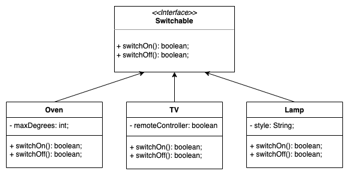

# Lesson 8: OOP Recap

## Goals

- Recap all OOP concepts
- Practice creating classes

## OOP Fundamentals
What we introduced so far is instrumental for Java to reach the three fundamentals of the OOP: **Encapsulation**, 
**Inheritance** and **Polymorphism** 

### Encapsulation
Some modifiers can act on properties and methods (collectively known as members) of a class to affect its visibility. 
Those are:

- `public`: to make it visible for any other class
- `protected`: to make it visible for classes in the same package or subclasses 
- `package` (default): to make it visible for classes in the same package
- `private`: to make it visible only to other members of the same class

> Classes have modifiers too, but they are only `public` or `package` (default)

The **encapsulation** is implemented by hiding the properties of a class to the other classes, i.e. declaring them as 
`private` and then implementing its getters and setters to manage the properties of an object accordingly to the
application constraints.

### Inheritance
Abstract classes are a way of designing ideas that are not immediately identifiable as a real entity in the world.
We know that a class can be instantiated, while Abstract classes cannot.
An Animal or a SortableItem cannot be immediately translated as objects, but needs to be **extended** or **implemented**
in concrete classes, that provide clear implementation to its ambiguous members (like `legs` or `moving()` or 
`compareTo()`);

The **extends** directive resemble the **inheritance** fundamental: whenever a class is extending another class, the
former (called subclass) inherits properties and methods of the latter (superclass). 

### Polymorphism
Extension and implementations of interfaces contribute to give similar shape to different objects. We can easily say that
a Lamp, a TV or an Oven can be switched on, but when we actually do that, we act differently, we use different methods.
If we sketch these ideas in java, we can easily identify the classes Lamp, TV, and Oven as implementing a Switchable
interface

```java
public interface Switchable {
    public boolean switchOn();
    public boolean switchOff();
}
```


Then we can act on all of those Switchable items programmatically by invoking these methods
```java
public class Main {
    public static void main(String args[]) {
        List<Switchable> homeAppliances = new ArrayList<Switchable>();
        homeAppliances.add(new Oven());
        homeAppliances.add(new Lamp());
        homeAppliances.add(new TV());
        
        for (Switchable appliance: homeAppliances) {
            appliance.switchOn();
        }
    }
}
```


## [OOP Review Classroom activity](https://classroom.github.com/a/i39IlGbD)

#### Follow the link, accept and download the assignment from GitHub Classroom
This exercise consists of creating 2 classes to hold Rating and Movie info.

## [OOP Review Exercise](https://classroom.github.com/a/ikzsCVEM)

#### Follow the link, accept and download the assignment from GitHub Classroom

Good luck and have fun!

## Materials

- [Object-Oriented Programming Concepts by Oracle](https://docs.oracle.com/javase/tutorial/java/concepts/index.html)
- [Providing Constructors for Your Classes](https://docs.oracle.com/javase/tutorial/java/javaOO/constructors.html)
- [OOP: Everything you need to know about Object Oriented Programming](https://medium.com/from-the-scratch/oop-everything-you-need-to-know-about-object-oriented-programming-aee3c18e281b)
- [4 Pillars for Object Oriented Programming](https://www.linkedin.com/pulse/4-pillars-object-oriented-programming-pushkar-kumar/)

