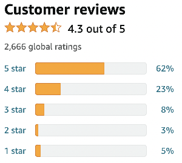

# Lesson 9: Data Structures - Set & Map

## Goals

- What is a `Set`?
- When do I need a `Set`?
- `Set` vs `List`
- What is a `Map`?
- Understand the different types of `Set` and `Map`.

## Recap

- What is an `Array`?
- What is a `List`?
- What are the differences between `Array` & `List`?

## Presentation

[Link](https://docs.google.com/presentation/d/1u7_eK6VpGtFGE6rfGUjfmFFzb8UvTPVD-96VSj6v9h4/embed ){:target="_blank"}

## What is a Set?

- A `Set` is a collection of items that contains no duplicate items / only unique elements.

> More formally, a `Set` contains no pair of items `e1` and `e2` such that `e1.equals(e2)` is true.

1. Let's analyse the following code. What's the final size of the `Set`?
  ```java
public class Main {
    public static void main(String[] args) {
        Set<Integer> set = new HashSet<>();
        set.add(3);
        set.add(4);
        set.add(5);
        int size = set.size(); // ??
        boolean contains3 = set.contains(3); // ??
        boolean contains5 = set.contains(5); // ??
    }
}
  ```
2. Let's analyse another code. What's the final size of the `Set`?
  ```java
public class Main {
    public static void main(String[] args) {
        Set<Integer> set = new HashSet<>();
        set.add(3);
        set.add(4);
        set.add(3);
        int size = set.size(); // ??
        boolean contains3 = set.contains(3); // ??
        boolean contains5 = set.contains(5); // ??
    }
}
  ```
> As stated above, you need a Set when you are interested in having only unique items.

## What is a Map?

- A `Map` is a collection of _unique_ keys and a corresponding (assigned) value for each key.
- A `Map` allows you to look for a value based on a given key.

> More formally, a `Map` is a collection of key-value pairs containing no pair of keys `k1` and `k2`
> such that `k1.equals(k2)` is true.

1. Let's analyse the following code. What's the final size of the `Map`?
  ```java
public class Main {
    public static void main(String[] args) {
        Map<String, Integer> map = new HashMap<>();
        map.put("car", 5);
        map.put("bicycle", 2);
        map.put("bus", 0);
        int size = map.size(); // ??
        boolean containsCar = map.containsKey("car"); // ??
        boolean containsBus = map.containsKey("bus"); // ??
        int car = map.get("car"); // ??
        Integer bus = map.get("bus"); // ??
        int bus = map.get("bus"); // ??
    }
}
  ```

> As stated above, you need a `Map` when you are interested in keeping a dictionary or mapping of keys to values.

## HashSet and HashMap

- **Ordering is not important**
- `HashSet` uses the `equals` and `hashCode` methods to ensure that the items in the `Set` are unique.
- `HashMap` uses the `equals` and `hashCode` methods to ensure that the keys in the `Map` are unique.

> When in doubt, use the `HashSet` and `HashMap`.

## TreeSet and TreeMap

- **Ordering is important**
- `TreeSet` is a **Binary Search Tree** that uses the `compareTo` method to ensure that the items in the `Set` are unique and are sorted in the right order.
- `TreeMap` is a **Binary Search Tree** that uses the `compareTo` method to ensure that the keys in the `Map` are unique and are sorted in the right order.
- Learn about [**Binary Search Tree**](https://www.youtube.com/watch?v=pYT9F8_LFTM ){:target="_blank"}

## Exercise

Remember the [Star Classification](https://en.wikipedia.org/wiki/Star_(classification) ){:target="_blank"} challenge from the last assignment? Well, let's implement it using a Map!



Define a class called `Ratings`, use a Map to store the ratings' information, and implement all the following behaviours:
- `void addRating(int stars)`: Used for adding a rating from a customer. It receives a star rating from 0 to 5 (only).
- `int getAmountRatings()`: Returns the total amount of ratings given to this product.
- `int getAmountRatings(int stars)`: Returns the total amount of ratings of a specific star (e.g. how many customers gave 4 stars for this product). The method should return 0 if an invalid rating is specified.
- `float getAverageRating()`: Returns the average of all given ratings for the product. If there are no ratings, it should return -1.

## [Set & Map Assignment](https://classroom.github.com/a/dUh1YtIJ ){:target="_blank"}

#### Follow the link, accept and download the assignment from GitHub Classroom