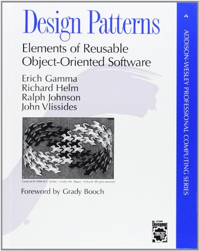
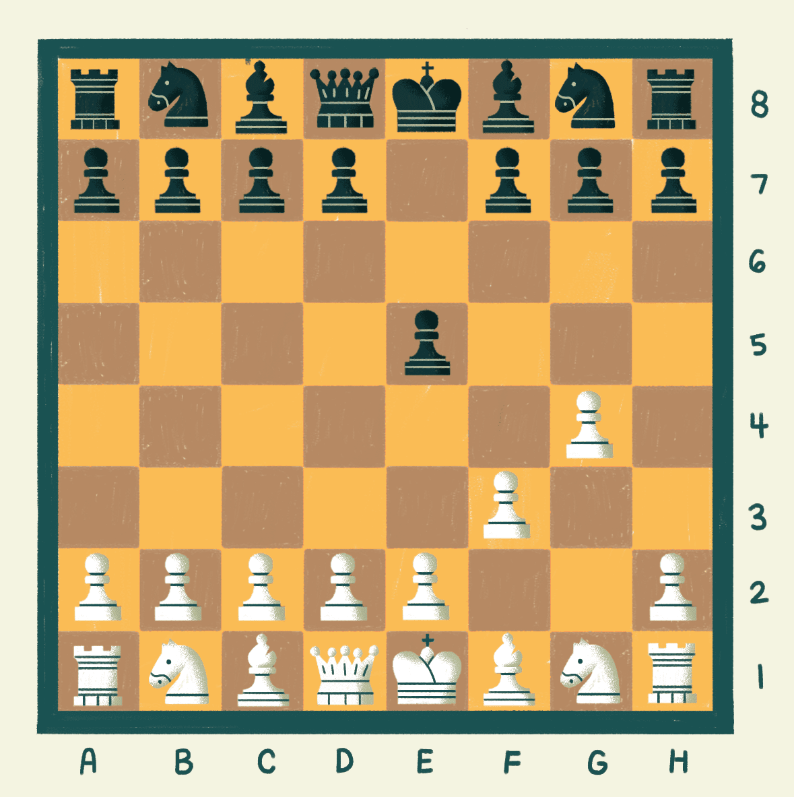

# Lesson 13: Design Patterns

## Goals
Understand design patterns as a way of solving notable problems in OOP.

## The GoF (Gang of Four)
The whole literature about the design patterns started in 1994 with the 
book "Design Patterns: Elements of Reusable Object Oriented Software", by
Erich Gamma, John Vlissides, Ralph Johnson, and Richard Helm. Due to the 
success of this widespread book, it was soon referred as "the GoF book".



They identified 23 generic patterns in software programming, as well as many
designed solution in OOP language to solve them, hence, the Design Patterns.

### Early example - the Singleton
Let's assume you are creating an application to manage lines in a post office.
The office has many front desks that can carry any operation, so that the customers
wait in a single line. 


You are tasked to let every new customer get the next
available spot, by implementing a TicketDispenser:

```java
public class TicketDispenser {
    private int current;
    
    public int getNextTicket() {
        return current++; //increment current and return its value
    }
}
```

With this implementation, a cheating customer can easily get a ticket with value 1
by just getting another instance of TicketDispenser
```java
public class Main {

    public static void main(String[] args) {
        TicketDispenser td = new TicketDispenser();

        System.out.println("First customer has ticket: " + td.getNextTicket()); // 1
        System.out.println("Second customer has ticket: " + td.getNextTicket()); // 2
        System.out.println("Third customer has ticket: " + td.getNextTicket()); // 3

        System.out.println("Cheating...");
        TicketDispenser td2 = new TicketDispenser();
        System.out.println("Fourth customer has ticket: " + td2.getNextTicket()); // 1
    }
}
```

The aim of the Singleton design pattern is to let just exactly one instance of a class
to be ever created. The classic implementation is

```java
public class SingletonTicketDispenser {
    
    // 1. create the instance as part of the class definition
    private static final SingletonTicketDispenser instance = new SingletonTicketDispenser();
    
    // 2. make the constructor private
    private SingletonTicketDispenser () {}
    
    // 3. expose a public static method to get the instance
    public static SingletonTicketDispenser getInstance() {
        return instance;
    }
    
    //same code as TicketDispenser
}
```

Now changing the main to use the singleton instance 

```java
SingletonTicketDispenser td = SingletonTicketDispenser.getInstance();
[...]
        
SingletonTicketDispenser td2 = SingletonTicketDispenser.getInstance();
```

will result in blocking any cheating customer.

```
Fourth customer has ticket: 4
```

### Why do we need patterns at all?
Patterns are ready to use, stable and tested solutions to notable problems.
It's like a toolset a programmer has to speed up the implementation of its tasks.
Whenever you are able to identify a notable problem in your requirement, you
know how to solve it by using a well documented pattern.

Being able to master available patterns while coding comes from the experience. It's
like playing chess: after a while you are aware of classic situations and you now
the best n moves to make. With design patterns you will never fall in 
[fool's mate](https://www.youtube.com/watch?v=jrUalgPaiPQ ){:target="_blank"} again!



### The design pattern classification
After the GoF book have been published, the programmers have added more and
more patterns to the list. Some of them are small and applicable to a single
programming language, and they are called _idioms_. Others are very high-level
and can be used to design an entire application: they are called _architectural
patterns_.

Whatever the scope of a pattern, we can always identify an _intent_ to
a given pattern; the GoF ones fall into three categories

1. **Creational Patterns**: that deal with the creation of objects - the Singleton is here!
2. **Structural Patterns**: defining relationship between objects; 
3. **Behavioral Patterns**: focusing on objects interactions definition.

For a full list of the patterns from GoF, see the [Additional Resources](#additional-resources) section.

## [Design Patterns Exercise](https://classroom.github.com/a/q-0qTY9E ){:target="_blank"}

Follow the [link](https://classroom.github.com/a/q-0qTY9E ){:target="_blank"} and download the exercise from GitHub Classroom.

## [Design Patterns Assignment](https://classroom.github.com/a/ayYQF8Gq ){:target="_blank"}

Follow the [link](https://classroom.github.com/a/ayYQF8Gq ){:target="_blank"} and download the assignment from GitHub Classroom.

## Additional Resources

 - [Refactoring guru - Design Patterns](https://refactoring.guru/design-patterns)
