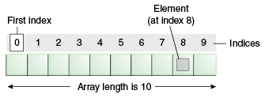

# Lesson 3: Data Structure - Arrays and Lists

## Goals

* Declare & Initialise Array and Access its elements
* Declare & Initialise ArrayList and Access its elements
* Understand the difference between Array vs List
* Discuss different kind of Lists
* Code, code, code 🤩

## Recap & Assignment check

Let's look into the assignment from lesson 2

## Array

An array is a collection of items in contiguous memory blocks. An array is a container object that 
holds a fixed number of values of a single type. The length of an array is established when the 
array is created. After creation, its length is fixed. You have seen an example of arrays already, 
in the main method of the "Hello World!" application. This section discusses arrays in greater 
detail.



Each item in an array is called an element, and each element is accessed by its numerical index. 
As shown in the preceding illustration, numbering begins with 0. The 9th element, for example, 
would therefore be accessed at index 8.

### Declare & Initialise Array

To create an array in Java, you use three steps:

* Declare a variable to hold the array.
* Create a new array object and assign it to the array variable.
* Store things in that array.

#### Unidimensional Array

This is how you can declare arrays:

```java
public class Main {

  public static void main(String[] args) {
    // declares an array of integers
    // and allocates memory for 10 integers
    int[] anArray = new int[10];

    // initialize first element
    anArray[0] = 100;
    // initialize second element
    anArray[1] = 200;
    // and so forth
    anArray[2] = 300;
    anArray[3] = 400;
    //.
    //.
    //.
    for (int i = 0; i < anArray.length; i++) {
      // access and print the i-th element
      System.out.printf("Element at index %d: %d%n", i, anArray[i]);
    }
  }
}
```
Alternatively, you can use the shortcut syntax to create and initialize an array:

```java
public class Main {

  public static void main(String[] args) {

    // declares an array of integers
    // and allocates memory for 10 integers
    // and initializes all elements
    int[] anArray = {
        100, 200, 300,
        400, 500, 600,
        700, 800, 900, 1000
    };

    for (int i = 0; i < anArray.length; i++) {
      // access and print the i-th element
      System.out.printf("Element at index %d: %d%n", i, anArray[i]);
    }
  }
}
```
Here the length of the array is determined by the number of values provided between braces and 
separated by commas.

Finally, you can use the built-in length property to determine the size of any array. 
The following code prints the array's size to standard output:

    System.out.println(anArray.length);

#### Unidimensional Array

So far, we have only discussed arrays with one dimension, however, an array can also be
multi-dimensional i.e.

You can also declare an array of arrays (also known as a multidimensional array) by using two or 
more sets of brackets, such as String[][] names. Each element, therefore, must be accessed by a 
corresponding number of index values.

In the Java programming language, a multidimensional array is an array whose components are 
themselves arrays and the rows are allowed to have different lengths, as shown in the 
following `MultiDimArrayDemo` program:

```java
class MultiDimArrayDemo {
    public static void main(String[] args) {
        String[][] names = {
            {"Mr. ", "Mrs. ", "Ms. "},
            {"Smith", "Jones"}
        };
        // Mr. Smith
        System.out.println(names[0][0] + names[1][0]);
        // Ms. Jones
        System.out.println(names[0][2] + names[1][1]);
    }
}
```

## Lists

In Java, we need to declare the size of an array before we can use it. Once the size of an array is
declared, it's not possible to change it.  What if we don't know how many elements will 
be in our array?

To handle this issue, we can use the `List` data structure. The List data structure is defined in
Java by the `List` interface. Unlike arrays, lists can automatically adjust its capacity when we 
add or remove elements from it.

A `List` is an ordered collection (also known as a sequence). The user of this collection has precise
control over where in the list each element is inserted. The user can access elements by their 
integer index (position in the list), and search for elements in the list.

The `ArrayList` class is an implementation of the `List` interface which allows us to create 
resizable arrays.

The list interface looks like this:

```java
interface List<E>{
  // Adds the element to the end of the list increasing its size by 1.
  boolean add(E element);
  // Adds the element to position #index of the list increasing its size by 1.
  boolean add(int index, E element);
  // Replaces the element at position #index, does not increase the size.
  boolean set(int index, E element);
  // Returns the element at #index
  E get(int index);
  // Removes the element at #index and return that element.
  E remove(int index);
  // Removes the first occurrence of the specified element from this list, 
  // if it is present (optional operation).
  boolean remove(E element);
  // Returns the current size of the list
  int size();
}
```

> Question; What other methods can a `List` have?

### Declare & Initialise ArrayList

```java
// create Integer type arraylist
List<Integer> arrayList = new ArrayList<>();

// create String type arraylist
ArrayList<String> arrayList = new ArrayList<>();
```

Note: We can not create array lists of primitive data types like int, float, char, etc. Instead, we
have to use their corresponding wrapper class.

### Methods of ArrayList

Add elements

```java
ArrayList<String> animals = new ArrayList<>();

// Add elements
animals.add("Dog");
animals.add("Cat");
animals.add("Horse");
System.out.println("ArrayList: " + animals);
```

Add Using index number

```java
ArrayList<String> animals=new ArrayList<>();

// Add elements
animals.add(0,"Dog");
animals.add(1,"Cat");
animals.add(2,"Horse");
System.out.println("ArrayList: " + animals);
```

Access ArrayList elements

```java
// Get the element from the array list
String str = animals.get(0);
System.out.print("Element at index 0: " + str);
```

Access ArrayList elements in foreach loop

```java
for (int i = 0; i < animals.size(); i++) {
    System.out.println(animals.get(i));
}

for (String animal: animals) {
    System.out.println(animal);
}
```

Change ArrayList Elements

```java
animals.set(2, "Zebra");
System.out.println("Modified ArrayList: " + animals);
```

Remove ArrayList Elements

```java
String str = animals.remove(2);
System.out.println("Final ArrayList: " + animals);
System. out.println("Removed Element: " + str);
```

Java ArrayList To Array
```java
// Create a new array of String type
String[] arr = new String[animals.size()];

// Convert ArrayList into an array
animals.toArray(arr);
```

Java Array to ArrayList

```java
// Create an array of String type
String[] arr = {"Dog", "Cat", "Horse"};

// Create an ArrayList from an array
ArrayList<String> animals = new ArrayList<>(Arrays.asList(arr));
```

> Question; What other kind of `Lists` do we have?

> Question; How do you find out whether the given `List` is empty or not?


## [Exercises and Assignments](https://classroom.github.com/a/vi1e0wLM)

Please download the assignment on GitHub classroom.

### Print reversed array

In the java class `PrintReversed` (file in the github repository `src/main/java/com/redi/j2/PrintReversed.java`):

1. Complete the method `printReversedArray` that will print an `int` array reversed. For an array
   `{1,3,5,2,4}`, it prints `{4,2,5,3,1}`
2. Write another method `printReversedList` that will print an `Integer` array reversed.

### Merge 2 arrays

In the java class `Merge` (file in the github repository `src/main/java/com/redi/j2/Merge.java`):

1. Complete the method `mergeArrays` that will merge two int arrays into another int array and
   returns it. The merge rule is that for each index, that the element of the first array goes
   before the element of the second array e.g.

   ```
   first = {2, 5, 9}
   second = {1, 4, 0}
   merge = {2, 1, 5, 4, 9, 0}
   ```
   The two arrays are of the same length.

2. Write another method `mergeLists` that will do the same using `List` of `Integers`.

> However, how would you handle it if the two arrays are of different length?

### Find an element

In the java class `FindElement` (file in the github repository `src/main/java/com/redi/j2/FindElement.java`):

1. Complete the method `findFirstInArray` that gets as input a `String` array and a `String`. The
   method should return the first position of the string in this array or -1 if the string is not in
   the array.
2. Write another method called `findLastInArray` that returns the last position of the element.
3. Write the equivalent methods `findFirstInList` and `findLastInList` that does the same as above
   but using a list instead.

### Second smallest

In the java class `SecondSmallest` (file in the github repository `src/main/java/com/redi/j2/SecondSmallest.java`), complete the method `secondSmallest` to return the second-smallest item in an array of integers.

For example
- the second smallest of `[0, 1, 2, 3]` is `1`
- the second smallest of `[1, 3, 4, 1, 1, 4, 2]` is `2` and
- the second smallest of `[2]` is `2`

## Extra exercises

### Find all elements less than X

Write a program to find all elements of the array of ints that are less than X

### Build Sum element

Given an array arr[] of n integers, construct a Sum Array sum[] (of same size) such that sum[i] is
equal to the sum of all the elements of arr[] except arr[i].

### Create an Array from the terminal

Add elements to the array from the terminal until the user enters nothing

### Square matrix calculations

Write user defined methods for square matrix to calculate:

- Left diagonal sum
- Right diagonal sum

### Swap two elements

Write a Java program of swap two elements in an array list. User enters the positions. Check user's
inout, that positions are valid

### Organizing array

Given an array arr[] of random integers, the task is to push all the zero’s in the array to the
start and all the one’s to the end of the array. Note that the order of all the other elements
should be the same.

Example:

Input: arr[] = {1, 2, 0, 4, 3, 0, 5, 0} Output: 0 0 0 2 4 3 5 1

### Check if it is a subset array

Given two arrays and we need to find whether one array is a subset of other or not

Example:
Input:
array1: 1 6 5 array2: 1 4 7 3 5 6

output: yes


## Materials

- [Arrays from Oracle](https://docs.oracle.com/javase/tutorial/java/nutsandbolts/arrays.html)
- [ArrayList from Oracle](https://docs.oracle.com/javase/7/docs/api/java/util/ArrayList.html)
- [Arrays](https://www.programiz.com/java-programming/arrays)
- [ArrayList](https://www.programiz.com/java-programming/arraylist)
- [Java Arrays](http://tutorials.jenkov.com/java/arrays.html)
- [More Java Arrays](https://www.w3schools.com/java/java_arrays.asp)
- [Multidimensional arrays](https://www.geeksforgeeks.org/multidimensional-arrays-in-java/)
