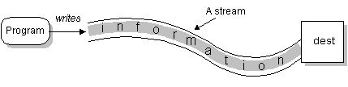
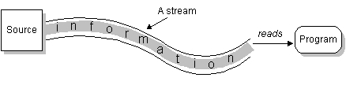

# Lesson 12: File Input/Output (I/O)

## Goals

- Learn how we read from and write to file.

## Input & Output Stream

### What is a `Stream`, `InputStream` & `OutputStream`?

Geographically:

> _A **stream** is a body of water that flows on Earth's surface i.e water flowing from one place to another._

In computer science:

> _a **stream** is a sequence of data elements made available over time. A **stream** can be thought of as items on a conveyor belt being processed one at a time rather than in large batches.

> A **bytestream** is a stream of bytes._

Data or information are stored in memory as a sequence of bits or bytes which is a sequence of 8 bits and in order to
transfer this data from one place to another we need a **bytestream**.

Scenarios where bytestream are used:

- Uploading or sending data over a network
- Downloading or receiving data over a network
- Reading data or files from a file system e.g. a hard drive of a computer
- Writing data or files into a file system e.g. a hard drive of a computer





> _an `InputStream` is an abstract class representing an inflow of bytes. To read data from a bytestream, one uses an `InputStream`_
> `System.in` is an `InputStream` that can be used to read data from the standard input stream.

```java
public abstract class InputStream implements Closeable {
    //Reads the next byte of data from the input stream as an int between 0 and 255. 
    //Returns -1 if there is no data.
    public abstract int read() throws IOException;

    //Closes this input stream and releases any system resources associated with the stream.    
    public abstract void close() throws IOException;
}
````

Q: What is a `FileInputStream`?

> _an `OutputStream` is an abstract class representing an outflow of bytes. To write data into a bytestream, one uses an `OutputStream`._
> `System.out` is an `OutputStream` that can be used to read data from the standard output stream.

```java
public abstract class OutputStream implements Closeable {
    //Writes the specified byte to this output stream.
    public abstract void write(int b) throws IOException;

    //Closes this output stream and releases any system resources associated with the stream.    
    public abstract void close() throws IOException;
}
````

Q: What is a `FileOutputStream`?

A bytestream is _usually_ opened upon creation, however; one must close a bytestream after usage.

### What is a `Reader` & `Writer`?

**A `String` is a sequence or stream of characters** and because data is often exchanged in human-readable `String`
format, therefore we need both the `Reader` and `Writer` to easily read and write characters into bytestreams.

Q: How many bytes is a character?

_A `Reader` is an abstract class for reading characters to streams while a `Writer` is an abstract class used for
writing characters to stream._

```java
public abstract class Reader implements Closeable {
    //Reads and returns a single character as in int and returns -1 if it is the end of the stream.
    public abstract int read() throws IOException;

    //Closes this reader and releases any system resources associated with the stream.    
    public abstract void close() throws IOException;
}
````

```java
public abstract class Writer implements Readable, Closeable {
    //Writes the specified character to the output stream.
    public abstract void write(int b) throws IOException;

    //Closes this writer stream and releases any system resources associated with the stream.    
    public abstract void close() throws IOException;
}
````

Q: What is an `InputStreamReader`? Q: What is a `OutputStreamWriter`? Q: What is a `FileReader`? Q: What is
a `FileWriter`?

A **character encoding** tells the system how to interpret raw bytes into real characters. In order to use a `Reader` or
`Writer` we must specify the character encoding.

The default character encoding in Java is `UTF-8`.

## Reading and Writing Files

- A `FileInputStream` is an `InputStream` that reads input bytes from a file in a file system.
- A `FileOutputStream` is an `OutputStream` that writes bytes into a file in a file system.
- A `FileReader` is an `InputStreamReader` that reads characters from a file in a file system.
- A `FileWriter` is an `OutputStreamWriter` that writes characters into a file in a file system.
- A file path is a string describing the location of a file in a file system.

To read from a file, we need the file path and a `FileReader`. A `FileInputStream` will be created and be used by the
`FileReader`.

To write into a file, we need the file path and a `FileWriter`. A `FileOutputStream` will be created and be used by the
`FileWriter`.

By default a `FileWriter` or `FileOutputStream` removes the existing content of the file and starts writing data into
it. However, both the `FileWriter` and `FileOutputStream` can be created and opened in `append` mode; this implies that
whatever is written to the stream is appended to the existing file i.e. we do not delete the existing content of the
file.

### Example: Read and write a text file character by character

#### The Hard Way

```java
public class ReadFileCharByChar {
    public static void main(String[] args) {
        FileReader reader = null;
        FileWriter writer = null;
        try {
            reader = new FileReader("input-file.txt");
            writer = new FileWriter("output-file.txt");

            int next = -1;

            while ((next = reader.read()) != -1) {
                writer.write(next);
            }

        } catch (IOException e) {
            e.printStackTrace();
        } finally {
            if (reader != null) {
                try {
                    reader.close();
                } catch (IOException e) {
                    e.printStackTrace();
                }
            }
            if (writer != null) {
                try {
                    writer.close();
                } catch (IOException e) {
                    e.printStackTrace();
                }
            }
        }
    }
}
```

#### The Easier Way

```java
public class ReadFileCharByChar {
    public static void main(String[] args) {
        try (FileReader reader = new FileReader("input-file.txt");
             FileWriter writer = new FileWriter("output-file.txt")) {
            int next;
            while ((next = reader.read()) != -1) {
                writer.write(next);
            }
        } catch (IOException e) {
            e.printStackTrace();
        }
    }
}
```

### `BufferedReader` & `BufferedWriter`

> `BufferedReader`: Reads text from a character-input stream, buffering characters to provide for the efficient
> reading of characters, arrays, and lines.

> `BufferedWriter`: Writes text to a character-output stream, buffering characters to provide for the efficient
> writing of single characters, arrays, and strings.

This is what you often need because processing files are often done line by line and both the `BufferedReader` and
`BufferedWriter` allows us to do that. It is the responsibility of the programmer to be aware of the following
especially when reading a file.

- The encoding of the text files
- The size of the file
- The maximum line length of the file
- The number of lines of the file

This information allows the programmer to make an informed decision of how to process the file without any interruption
and the biggest concerns are reading exactly what is expected and ensuring that it fits into memory.

#### The Hard Way

```java
public class ReadFileLineByLine {
    public static void main(String[] args) {
        BufferedReader reader = null;
        BufferedWriter writer = null;
        try {
            reader = new BufferedReader(new FileReader("input-file.txt"));
            writer = new BufferedWriter(new FileWriter("output-file.txt"));

            String next = null;

            while ((next = reader.readLine()) != null) {
                writer.write(next);
                writer.newLine();
            }

        } catch (IOException e) {
            e.printStackTrace();
        } finally {
            if (reader != null) {
                try {
                    reader.close();
                } catch (IOException e) {
                    e.printStackTrace();
                }
            }
            if (writer != null) {
                try {
                    writer.close();
                } catch (IOException e) {
                    e.printStackTrace();
                }
            }
        }
    }
}
```

#### The Easier Way

```java
public class ReadFileLineByLine {
    public static void main(String[] args) {
        try (BufferedReader reader = new BufferedReader(new FileReader("input-file.txt"));
             BufferedWriter writer = new BufferedWriter(new FileWriter("output-file.txt"))) {

            String next;

            while ((next = reader.readLine()) != null) {
                writer.write(next);
                writer.newLine();
            }

        } catch (IOException e) {
            e.printStackTrace();
        }
    }
}
```

### Java 11 tricks

- Read the entire file into string: `String Files.readString(Path path)`
  ```java
    Files.readString(Path.of("input-file.txt"));
  ```
- Read a file line by line: `List<String> Files.readAllLines(Path path)`
  ```java
    List<String> lines = Files.readAllLines(Path.of("input-file.txt"));
  ```
- Write lines into a file: `Path Files.write(Path path, List<String> lines)`
  ```java
    List<String> lines = List.of("one", "two");
    Files.write(Path.of("output-file.txt"), lines);
  ```
- Write string into a file: `Path Files.writeString(Path path, String string, OpenOption...options)`
  ```java
    String string = "one\ntwo\n";
    Files.writeString(Path.of("output-file.txt"), string);
  ```

Be careful using these methods since you lose control over the underlying resources or risk reading a huge file into
memory which can lead to the application running out of memory and crashing.

_Please use the above methods only if necessary for the assignment exercise._

## [Github Classroom Exercises](https://classroom.github.com/a/v_iYcSA9)

### Follow the link, accept and download the assignment from GitHub Classroom

YYou have been provided by the class  [`ReadFileLineByLine`](src/main/java/com/redi/j2/ReadFileLineByLine.java)
with two methods demonstrating how to copy from one file to another file line by line.

Please go through those methods and observe the differences between them.

**For these exercises, please only
use [`ReadFileLineByLine#theEasierWay`](src/main/java/com/redi/j2/ReadFileLineByLine.java) to read or write from the
file.**

## Exercise

**For these exercises, please only
use [`ReadFileLineByLine#theEasierWay`](src/main/java/com/redi/j2/ReadFileLineByLine.java) to read or write from the
file.**

### 1 - Sort Line

Write a method that sorts a given file line by line. At the end of the execution, the file must be sorted.

In the package [`com.redi.j2`](src/main/java/com/redi/j2), create a public class `SortLine`, and in this class create a
public static method `sortLine`. Input of the method should be a `String path` which is the path to the file that needs
to be sorted.

For example if I have a file `/path/to/my/MyFile.txt` with the following content

```text
This is because we feel pain.
Land is good.
Who's calling on the phone this late at night?
The quick brown fox jump over the lazy dog.
A high APR is a bad thing.
This is my younger brother.
Lenora only had eight fingers, after losing both of her pinkies to a freak accident with a hay baler.
```

After I invoke `SortLine.sortLine("/path/to/my/MyFile.txt")`, then the file should have the following content.

```text
A high APR is a bad thing.
Land is good.
Lenora only had eight fingers, after losing both of her pinkies to a freak accident with a hay baler.
The quick brown fox jump over the lazy dog.
This is because we feel pain.
This is my younger brother.
Who's calling on the phone this late at night?
```

### 2 - CSV Students

1. In the package [`com.redi.j2`](src/main/java/com/redi/j2), create a class `Student` to represent a student
    1. with the following properties
        - `UUID id` a unique identifier of the student
        - `String firstName`
        - `String lastName`
        - `int height`
        - `int weight`
        - `LocalDate dateOfBirth`
    2. Add a constructor for `Student` with all the properties in the order specified above.
    3. All properties of `Student` must be private and final.
    4. Please implement getters, `equals`, `hashCode` and `toString`
2. Validations - All exceptions are custom and must be unchecked i.e. should extend `RuntimeException`
    1. if the `firstName` or `lastName` is empty, throw a custom `BadNameException`
    2. if the `height` is not positive throw a `BadHeightException`
    3. if the `weight` is not positive throw a `BadWeightException`
    4. if the `dateOfBirth` is in the future, throw a `BadDateException`
    4. if any property is null, throw `NullPointerException`.
3. In the package [`com.redi.j2`](src/main/java/com/redi/j2), create a class `CSVStudents`
    1. **In this exercise, DO NOT CATCH or HANDLE any `IOException`!!**
    2. Create a private no-arg constructor for `CSVStudents`. We do this for utility classes so that they cannot be
       initialized nor inherited from. An utility class is a class that only has static methods.
    3. Create a public static method `read(path)` which accepts a `String` path and reads a CSV file that contains the
       students and returns a list of students in the order found in the CSV file.
        1. Must throw `BadCSVException` if the file extension is not `.csv`
        2. The first line of the CSV file is always the header.
        3. The header must be the name of the properties of the class `Student` in the order as listed above.
        4. The CSV is comma separated.
        5. If any of the conditions above is not satisfied, throw a custom runtime exception `BadCSVException`
        6. The method must return a list of students in the order found in the CSV file.
    4. Create a public static method `write(path,student)` which accepts a `Student` and a `String` path and writes this
       student to the CSV record.
        1. Must throw `BadCSVException` if the file extension is not `.csv`
        2. If the CSV file path doesn't exist, it must be created along with any missing parent directories.
        3. A new CSV file must be created with the headers in the order of the properties specified above
        4. If the CSV file does exist, then the student CSV record is appended to the CSV file.


## Materials

- http://www.c-jump.com/bcc/c257c/Week10/Week10.html``
