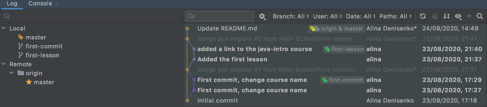

# Lesson 3: Git, GitHub & Integration with Intellij

## Goals
* Learn about Git & GitHub
* Create a GitHub account
* Connect Intellij & GitHub
* Import a project from GitHub
* Export a project to GitHub
* Apply changes and save them with GitHub
* Look in the changes log
* More java if we have time 🤩

## Recap & Homework check
Let's look into the homework from lesson 2

## Version Control
Version control is like a savings program for your project. 
By tracking and logging the changes you make to your file or file sets over time, a version-control system gives you the power to review or even restore earlier versions. 
Version control takes snapshots of every revision to your project. You can then access these versions to compare or restore them as needed.

Questions that Version control helps to answer
- Which changes were made?
- Who made the changes?
- When were the changes made?
- Why were changes needed?

## Git
Git is an extremely popular version control system (VCS) that is at the heart of a wide variety of high-profile projects.
Git is a distributed version-control system for tracking changes in source code during software development. 
It is designed for coordinating work among programmers, but it can be used to track changes in any set of text files. This focus on text is important to keep in mind as Git is extremely efficient and fast with textual content but can struggle when used with large images or other large files, for example zip or video, especially when they are changed often.

### Install Git 
[https://git-scm.com/book/en/v2/Getting-Started-Installing-Git](https://git-scm.com/book/en/v2/Getting-Started-Installing-Git)

## GitHub
GitHub is a cloud-based hosting service that lets you manage Git repositories.
[https://github.com/](https://github.com/)

Let's create a free account at GitHub (Demo)

Other Git repository hosting services also exist: GitLab, BitBucket, and SourceForge 

## Git workflow
In order to track changes, Git dictates a workflow for us. To understand this workflow let's look at the differents states of Git.

- `Working tree` or `working directory`: It is the area where you are currently working, any changes to files will be marked and seen here. If you do not save your changes in this state, they can be lost.
- `Staging` or `index`: It is the area where Git starts to track and saves you changes.
- `Local repository`: It is the area where all your files and changes are saved.

As you can see, this flow will allow us to track changes and keep history of them, but all of this is still in your local machine. In software development you will always be working in a team, therefore we have to share the code with others. This is where hosting services of Git come into play (i.e. GitHub). They will add a 4th state to the Git workflow which is the `remote repository`. It is the same as the local repository but contains all the changes from different people. This 4th state add the step of `pushing` our changes from the local repository to the remote repository and the `fetching` of other's changes from the remote repository to our local one.

## Git Commands
Some of the Git commands that are behind Intellij Magic 
* git add
* git commit
* git push 
* git pull (fetch & merge)
* git init
* git clone

### git add
Adds a change in the working directory
Tells Git that you want to include updates to a particular file in the next commit. 
Doesn't really affect the repository in any significant way

### git commit
Is used to save your changes to the local repository.
You have to explicitly tell Git which changes you want to include in a commit 
A file won't be automatically included in the next commit just because it was changed.

### git push 
Is used to upload local repository content to a remote repository. 
Pushing is how you transfer commits from your local repository to a remote repo.

### git pull
Is used to fetch and download content from a remote repository and immediately update the local repository to match that content. 
Is actually a combination of two other commands, `git fetch` followed by `git merge`.

### git clone
Cloning a local or remote repository

## Intellij & GitHub Integration
- In Intellij: Integrate Intellij with GitHub (Demo)

## GitHub -> Intellij
- In GitHub: Create a project
- In Intellij: Import project from GitHub (File -> New -> Project from Version Control)
- In Intellij: Change files, commit and push changes to GitHub
- In Intellij: Add a new file, commit and push changes to GitHub
- In Intellij: Remove a file from the project, commit and push changes to GitHub

## Intellij -> GitHub
- In Intellij: Create a new project, add a Java class
- In Intellij: Share your Project on GitHub 
    - VCS -> Commit
    - VCS -> Import into Version Control -> Share Project on GitHub
- In Intellij: Change files, commit and push changes to GitHub
- In Intellij: Add a new file, commit and push changes to GitHub
- In Intellij: Remove a file from the project, commit and push changes to GitHub

## History 
Check version control history
- In Intellij: Version Control -> Log
- In GitHub: Your Repository -> Code -> Commits 

## Some Java
### Integer array stats
Write a Java Program that finds a minimum value in the given array of integers. 
Commit the changes and push them to your GitHub.

Add a method to find a maximum value. 
Commit the changes and push them to your GitHub.

Add a method to find an average. 
Commit the changes and push them to your GitHub.

Can you do it in 1 loop?
Commit the changes and push them to your GitHub.

Look into the Git history 

### Palindrome string
Write a Program that checks that a given string is a palindrome. 
A string is Palindrome if position of each character remain the same in case even string is reversed. 
For example 'MADAM' is a palindrome string as position of each character remain same even if string 'MADAM' is reversed.

Commit the changes and push them to your GitHub.

### Vowels counter
Write a Java method to count all vowels (English Alphabet) in a string.

- Test Data: Input the string: this is a String.
- Expected Output: Number of  Vowels in the string: 4

- Test Data: Input the string: Are you checking Upper case?
- Expected Output: Number of  Vowels in the string: 10

Commit the changes and push them to your GitHub.

### Longest word
Given an array of Strings, find the longest String in the array.
Commit the changes and push them to your GitHub.

Add a method to find the longest word in the sentence, assume that input has only english alphabet and spaces
Commit the changes and push them to your GitHub.

Can you reuse the first method in the second method?
If there are some changes, you know what to do -> Commit the changes and push them to your GitHub.

### Factorial 
Write a program that calculates the factorial of a positive integer n, factorial is the product of all positive integers less than or equal to n: 
For example, The value of 0! is 1, according to the convention for an empty product
4! = 1 * 2 * 3 * 4 = 24

Commit the changes and push them to your GitHub.

## Homework
Upload your code from the previous classes to your GitHub profile & Finish the java tasks

## Materials
- [Learn Git Branching](https://learngitbranching.js.org/)
- [Git learning resources](https://try.github.io/)
- [Git homepage](https://git-scm.com/)
- [Idea Git help](https://www.jetbrains.com/help/idea/github.html)
