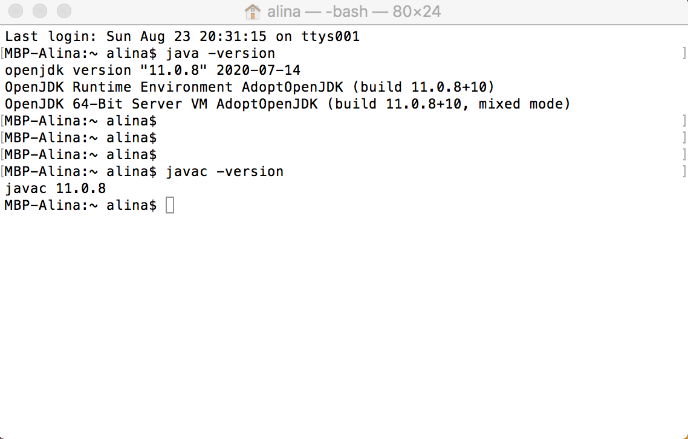

# Lesson 1: Introduction to Programming with Java

## Goals
* Getting to know each other
* Get familiar with schedule, attendance, tools
* Course introduction
* Check required software (Java & Intellij Idea)
* Do some basic Java exercises 🤩

### General info
* 📓 Course certificate only after minimum 80% attendance
* 💨 We don’t show up late to class (and inform otherwise)
* 🏝 We take a 10 minutes break in the middle of the class
* 🕺🏻 We are here for you! Always ask questions if something is not clear.
* 🚀 Never forget the feedback!
* 🕸 [Web](https://redi-school.github.io/intermediate-java), [Previous Semesters](https://redi-j2.netlify.com)
* 🐦 Slack: #21f_programming_java
* 🎓 We will have a Project at the end of the course!

### Content
* The Java language
* Git & Github
* Data structures
* Object Oriented Programming
* Exceptions
* Libraries
* Build Tools
* Unit Testing 
* File IO

## Let's check tools

### Java 

We use Java 11+. In the terminal/command line check that you have an installed jdk. 

-> java -version


### Intellij Idea
We use only functionality of Intellij Idea Community Edition. 
[Intellij Idea resources](https://www.jetbrains.com/idea/resources/)

You can find there short cuts, debugging tutorials, integration with verious version control systems (like Git)

## Java Basics Recap
```java
package com.redi.j2;

public class Main {

    public static void main(String[] args) {
        System.out.println("Hello World");

        String name = "Memet";
        String profession = "skydiver";
        int age = 40;
        boolean smoking = false;

        coolOrNotCool(profession);

        for (int i = 0; i < 10; i++) {
            System.out.println("hey " + i);
        }
    }

    private static void coolOrNotCool(String profession) {
        if (profession.equals("skydiver")) {
            System.out.println("Cool");
        } else {
            System.out.println("Not cool");
        }
    }
}
```

## Exercises

Write the method _squares_ that for X and Y given by arguments prints the square of each number between X and Y.

```java
square(1,3)
> 1 - 1
> 2 - 4
> 3 - 9

square(5,6)
> 5 - 25
> 6 - 36
```

If you don't know where to start, try creating a new Java class called ExerciseIntro and copy-pasting the following into it!

```java
public class ExerciseIntro {
    public static void main(String[] args) {
        square(1, 3);
        square(5, 6);
    }

    public static void square(int x, int y) {
        // your code needs to go here!
    }
}
```

### Exercise 2

In german, nouns ending with e are almost always feminine. Write a method _isFeminineNoun_ that checks if the provided word ends with e or not.

```
isFeminineNoun("Katze")
> true

isFeminineNoun("Hund")
> false
```

Bonus: can you also make sure the method also catches words ending in _-ung_? Those are also feminine.

## Homework

### [#0 Git & Github Fundamentals](https://classroom.github.com/a/fKsu9Nib)
### [#1 Introduction to Programming with Java](https://classroom.github.com/a/7vXI9ynd)

## Materials:
- [Intellij Idea. First Java Application Tutorial](https://www.jetbrains.com/help/idea/creating-and-running-your-first-java-application.html)
- [The Java Tutorials (from Oracle)](https://docs.oracle.com/javase/tutorial/)
- [W3Schools Java Tutorial](https://www.w3schools.com/java/)
- [O'Reilly Programming Podcasts](https://www.oreilly.com/topics/oreilly-programming-podcast)
