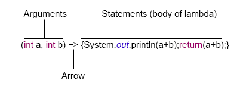

# Lesson 15: Streams

## Goals

- Learn what is lambda expression.
- Learn what are the streams.
- Learn how to use streams.
- Know some types of stream operations.

## Lambdas

A lambda expression is anonymous function that can be passed around and has the following syntax:



Some rules:

1. For Arguments - we can omit () if we have only 1 arg and don't indicate its type: `a -> {return a;}`
2. For Body - if we use `return`, we must surround it with `{}` and include `;` at the end

Further examples of lambda:

```java
  () -> ()
  a -> a.startsWith("test")
  (String a) -> a.startsWith("test")
  (a, b) -> a.startsWith("test")
  (String a, String b) -> a.startsWith("test")
```

## Streams

In Java 8 was introduced a new Package java.util.stream with classes for processing sequences of elements.

The central Stream API class is the `Stream<T>` where T is the type of the stream elements.

> `Stream<T>` - a sequence of elements of type T that supports specified operations.

We can create Stream from any collection by using stream() method from the Collection interface:

```java
  Stream<String> stream = list.stream();
```

## Streams Operations

Operations on a stream can be divided into **intermediate operations** (return Stream) and **terminal operations** (return a result of definite type). Intermediate operations can form a chain. Some stream operations:

| Intermediate operations | Terminal Operations |
| :---------------------- | :------------------ |
| distinct()              | count()             |
| sorted()                | forEach()           |
| filter()                | collect()           |
| map()                   | reduce()            |

### Example - intermediate distinct() and terminal count()

distinct() creates a new stream of unique elements of the previous stream.

count() calculates stream's size and returns it as long.

```java
  List<Integer> list = Arrays.asList(1,2,3,3,1,1);
  long count = list.stream().distinct().count();
  System.out.println(count);
  // Output: 3
```

### Example - intermediate filter() and sorted(), terminal forEach():

filter() forms a new stream where elements satisfy a certain condition. As argument we can use lambda that returns boolean.

sorted() - sorts elements of stream using natural order.

forEach() - performs action specified by argument on each stream's element. As an argument we can use lambda with no return.

```java
List<String> list = Arrays.asList("Monday","Tuesday","Wednesday","Thursday","Friday","Saturday","Sunday" );
list.stream().filter(element -> element.charAt(0) == 'T').sorted().forEach(s->System.out.println(s));
// Output:
// Thursday
// Tuesday
```

We found all days that begin with T, sorted them by alphabetic order and showed the result in console.

### Example - intermediate map() and terminal collect()

map() modifies each element of the stream by applying the action specified by argument. As argument we can use lambda that takes argument and return some value after manipulations with the argument (return value and argument may have different types)

collect() can convert stream to a Collection or other structures depending on argument. As argument we can use:

- Collectors.toList() - collects elements to List
- Collectors.toSet() - collects elements to to Set

```java
List<String> list = Arrays.asList("Monday","Tuesday" );
List<String> result = list.stream().map(element -> element.toUpperCase()).collect(Collectors.toList());
System.out.println(result);
// Output: [MONDAY, TUESDAY]
```

### Example - terminal reduce()

reduce() - reduces stream to a single value. We can use this method with 2 arguments - 1st is a start value and 2nd is an action that repeatedly combines all elements.

As a second argument we can use lambda that takes 2 arguments where 1st argument means partial result of reduction and 2nd argument means the next element of the stream.

```java
List<String> list = Arrays.asList("to ", "the ", "Future");
String film = list.stream().reduce("Back ", (s, c) -> s + c);
System.out.println(film);
// Output: Back to the Future
```

The same result without streams:

```java
String[] array = new String[] { "Back ", "to ", "the ", "Future " };
String film = "";
for (String s: array) film = film + s;
System.out.println(film);
```

## Exercises

For exerces create class Client with fields name, surname, loanAmount, isOverdue.
Create constructor that takes all these fields.
Create list of clients using the following data corresponding to client fields - name, surname, loanAmount, isOverdue:

- {"John", "Connor",10000, no},
- {"T1000", "T1000",27000, yes},
- {"Sarah", "Connor",80000, yes},
- {"Marty", "McFly",146000, no},
- {"Emmett", "Brown",12000, yes},
- {"Biff", "Tannen",500000, yes},

Using streams:

1. Count how many people took loan in the amount of greater than 50000
2. Make list of people's surname in alphabetic order that took loan greater than 10000
3. Calculate total amount of loans for people whose loan is overdue and is greater than 75000

## Homework

1. Given:

```java
   List<String> names = Arrays.asList("Amelia","Olivia","emily","Isla","Ava","oliver","Jack","Charlie","harry","Jakob").
```

Write code to print the names in sorted order and with the first letter in each name upper-cased, each name should be printed on a new line.
