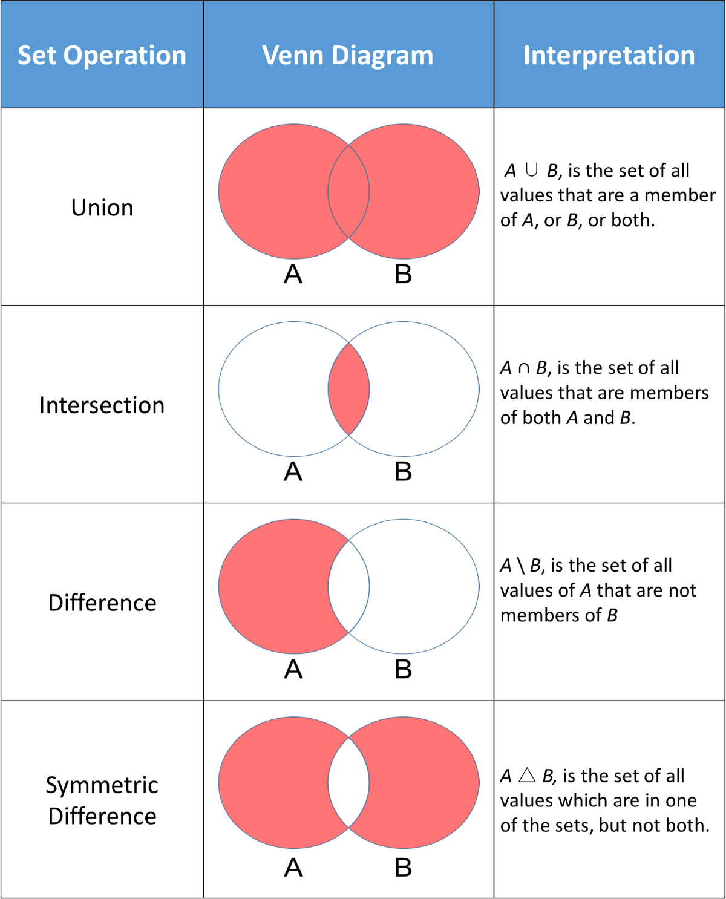

# Lesson 7: Sets

## Goals
* Learn what sets are
* Learn when to use sets
* Compare Sets vs Lists
* Java Set Implementations(HashSet & TreeSet)
* Common used sets methods (Set theory)

## Recap & Homework check
Let's look into the homework from lesson 6

## Sets


A set is a collection that contains no duplicate elements. 
Sets are like lists, they also contain elements of the same type.
However unlike lists it is impossible to access elements via an index, as there is no index.
Additionally lists can contain duplicate values.

### Set implementations
All implementations can be found [here](https://docs.oracle.com/javase/7/docs/api/java/util/Set.html).
However the most common ones are HashSet and TreeSet.

This is how you can declare a set:
```java
public class Main {
    public static void main(String[] args){
        Set<Integer> mySet = new HashSet<>();
    }
}
```

### HashSet
[HashSet](https://docs.oracle.com/javase/7/docs/api/java/util/HashSet.html) is the most commonly used set. 
It behaves exactly as you would expect it from a set:
- Doesn't guarantee any order
- Doesn't contain any duplicate elements
- Is fast in checking whether an element is contained within the set or not

### TreeSet
[TreeSet](https://docs.oracle.com/javase/7/docs/api/java/util/TreeSet.html) is less commonly used, but has the advantage
that it can keep the elements ordered:
- Guarantees an order (either defined or the natural order)
- Doesn't contain any duplicate elements
- Is fast in checking whether an element is contained within the set or not

### Methods of Sets

Add elements 
```java
HashSet<String> animals = new HashSet<>();

// Add elements
animals.add("Dog");
animals.add("Cat");
animals.add("Horse");
System.out.println("HashSet: " + animals);
```

Check HashSet elements 
```java
Boolean containsCow = animals.contains("Cow");
System.out.print("HashSet contains 'Cow'? " + containsCow);
```

Access HashSet elements in foreach loop 
```java
for (String animal : animals) {
    System.out.println(animal);
}
```

Remove HashSet Elements
```java
animals.remove("Dog");
System.out.println("Final HashSet: " + animals);
```

Java Array to HashSet
```java
// Create an array of String type
String[] arr = {"Dog", "Cat", "Horse"};

// Create a HashSet from an array
HashSet<String> animals = new HashSet<>(Arrays.asList(arr));
```

## Exercises

### Exercise 1
- Create a new HashSet of strings, add banana, apple, orange.
- Print content of sets using for loop
- Clear the set.
- Add one more element grapes.
- Check if set is empty, and if it’s not empty print “I am not empty!”. What is the order of elements after adding them to HashSet?

### Exercise 2
Write a static method randomSet that will return a HashSet containing a collection of n unique 
random numbers in range 0-100. In the main method iterate over the returned Set and print each 
number multiplied by 2. Where n is a number of random elements in set.

### Exercise 3
Change data type in previous exercise from HashSet to TreeSet. What is the difference?


### Exercise 4
Write a static method intersection that will return an intersection of two sets given by parameters. 
Note - sets given by parameters may not be modified.

### Exercise 5
Write a static method union that will return an union of two sets given by parameters. 
Note - sets given by parameters may not be modified. 

### Exercise 6
Write a static method difference that will return a difference between two sets given by parameters. Note - sets given by parameters may not be modified.

### Exercise 7
Create a TreeSet containing integers that will maintain descending order of numbers. Hint: Look at alternative TreeSet constructors.

## Additional exercises

### Exercise 1
Write a static method symetricDifference that will return the symetric difference between t wo sets given by parameters. Note - sets given by parameters may not be modified.

### Exercise 2
Write a method that takes an array with integers and return an array of unique values of the array

### Exercise 3
Write a method that takes a String and returns all unique characters of this String