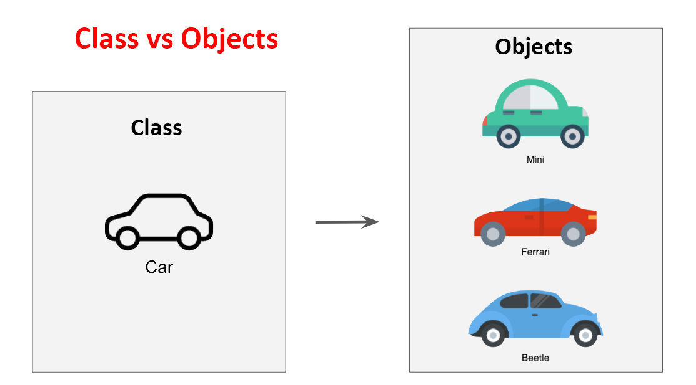
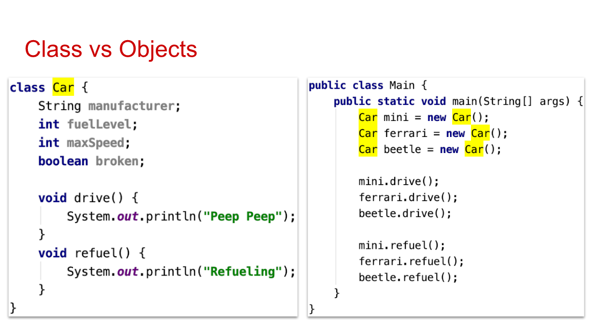
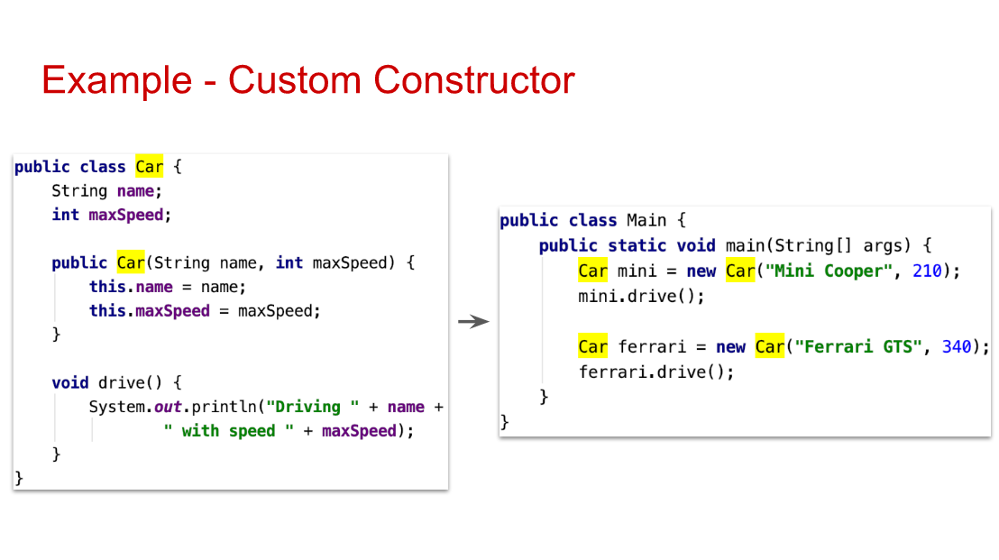
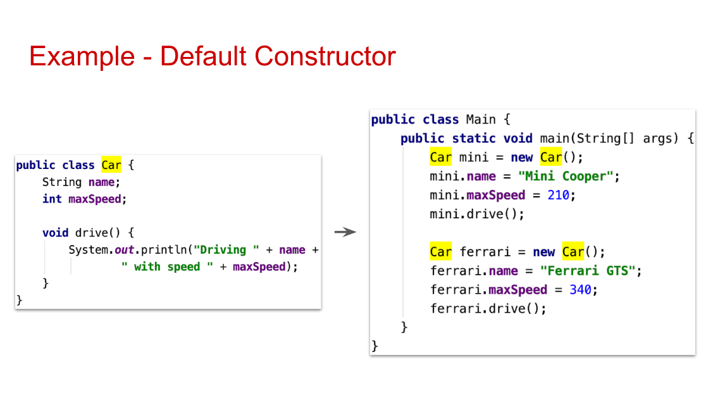
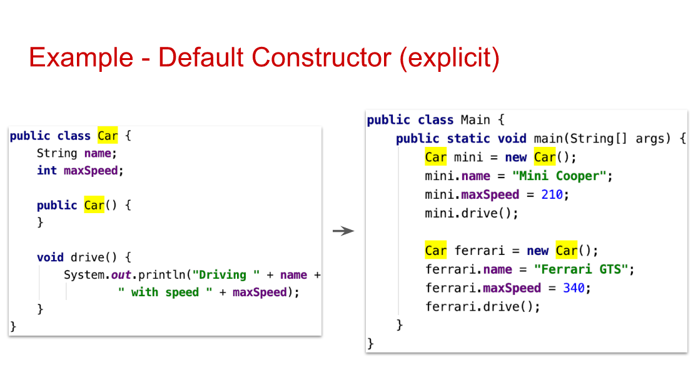

# Lesson 8: OOP 1 What is a class

## Goals

- Know what Object-Oriented Programming is.
- Be able to translate a real-life object to a programming object.
- Be able to create a Java class.
- Be able to instantiate an object of a Java class.
- Understand the difference between a class and an object.
- Have an overview about class constructors.
- Have an overview about the main concepts of OOP.

## Recap & Homework check

Let's look into the homework from lesson 7

## Object-oriented Programming

`Procedural programming` - software design around procedures or methods that perform operations on the data

`Object-oriented programming (OOP)` - software design around objects that contain both data and methods.

## Features of OOP

- Program is divided into small parts called objects.
- OOP follows bottom up approach.
- Adding new data and function is easy.
- OOP provides data hiding so it is more secure (access modifiers).
- OOP is based on real world.

## Classes

Class is a template for an object.

It tells JVM how to make an object of that particular type.



## How to design a class

When you design a class, think about the objects that will be created from that class type.

Think about:

- things the object knows (state / fields)
- things the object does (methods)



## Difference between class and object

| A Class                                                  | An Object                                                                      |
| :------------------------------------------------------- | :----------------------------------------------------------------------------- |
| is a template or blueprint                               | is an instance of a class/it's the working entity of the class                 |
| represents a type (a group of similar real-life objects) | represents an instance (a single real-life object such as pen, laptop, person) |

## Constructors

- Can be used to set initial value's for object's attributes/fields

- Exist inside the class and have the same name as the class

- Looks like a method but with no return type e.g. no "void"

- Class has one or more constructors







## Power of OOP - Encapsulation, Abstraction, Inheritance, Polymorphism

**Encapsulation**

Encapsulation means wrapping up data and member function (Method) together into a single unit i.e. class.

In encapsulation, the variables of a class will be hidden from other classes , and can be accessed only through the methods of their current class (**private access**).

**Abstraction**

Abstraction is the process of showing only essential/necessary features of an enity/object ot the outside world and hide the other irrelevant information

For example to turn on you TV you only have to click on the power button; it's not required to understand how infrared waves are getting generated in TV remote control

**Inheritance**

When you design inheritance, you put common code in a class and tell other more specific classes that the common class is their superclass, in this case you make a class to **extend** from superclass.

Benefits: you can avoide duplicate code and define a common protocol for a group of classes

**Polymorphism (Many Forms)**

A subclass can define its own unique behavior and still share the same functionalities or behavior of its parent/base class

Benefit: you can write code that doesn't have to change when you introduce new subclass types into the program

## Keep in mind / Tips

- There are **words** in the Java world that mean almost the same thing:

  - Class = Type
  - Class attributes = Class properties = Class fields
  - Methods = Functions = Procedures
  - Instance of a class = Object of a class
  - Instantiate an object = Create an object

- There is no **correct** solution and **incorrect** solution, but there is a **working**, a **not working** and a **better** solution

- Always choose **meaningful names** for your classes, methods and variables

- Try to keep your code **tidy** and well-formatted to make your life easier

## Exercise

Rewrite the following program in OOP.

Hint: You should create a class and use it to group the information about each student and use them to `introduce()` each student.

```java
import java.util.ArrayList;

public class Main {
    public static void main(String[] args) {
        String studentName1 = "Bob";
        String studentName2 = "Alice";
        String studentName3 = "John";
        String studentName4 = "Jane";

        int age1 = 36;
        int age2 = 25;
        int age3 = 19;
        int age4 = 46;

        boolean student1Single = false;
        boolean student2Single = true;
        boolean student3Single = true;
        boolean student4Single = false;

        String student1City = "Berlin";
        String student2City = "Moscow";
        String student3City = "San Fransisco";
        String student4City = "Rio";

        ArrayList<String> student1Friends = new ArrayList<>();
        ArrayList<String> student2Friends = new ArrayList<>();
        ArrayList<String> student3Friends = new ArrayList<>();
        ArrayList<String> student4Friends = new ArrayList<>();

        student1Friends.add("Alice");
        student1Friends.add("Jane");

        student2Friends.add("Bob");
        student2Friends.add("Jane");

        student3Friends.add("Jane");

        student4Friends.add("John");
        student4Friends.add("Alice");
        student4Friends.add("Bob");

        // introduce yourself (Student 1)
        System.out.println("My name is " + studentName1);
        System.out.println("I'm " + age1 + " years old");
        if (student1Single) {
            System.out.println("I'm single");
        } else {
            System.out.println("I'm in a relationship ^_^ ");
        }
        System.out.println("My friends are:");
        student1Friends.forEach(System.out::println);


        // introduce yourself (Student 2)
        System.out.println("My name is " + studentName2);
        System.out.println("I'm " + age2 + " years old");
        if (student2Single) {
            System.out.println("I'm single");
        } else {
            System.out.println("I'm in a relationship ^_^ ");
        }
        System.out.println("My friends are:");
        student2Friends.forEach(System.out::println);


        // introduce yourself (Student 3)
        System.out.println("My name is " + studentName3);
        System.out.println("I'm " + age3 + " years old");
        if (student3Single) {
            System.out.println("I'm single");
        } else {
            System.out.println("I'm in a relationship ^_^ ");
        }
        System.out.println("My friends are:");
        student3Friends.forEach(System.out::println);


        // introduce yourself (Student 4)
        System.out.println("My name is " + studentName4);
        System.out.println("I'm " + age4 + " years old");
        if (student4Single) {
            System.out.println("I'm single");
        } else {
            System.out.println("I'm in a relationship ^_^ ");
        }
        System.out.println("My friends are:");
        student4Friends.forEach(System.out::println);
    }
}
```

## Homework

You want to go to the bank and open an account. You want to be able to transfer money, deposit money, withdraw money.
When you transfer/withdraw the sum you have in your account can never go under 0 EUR.
You want to keep track of your transactions as well, to see where your money is going.
Whenever a new action is performed, print the current amount of money you have.

- Create an `Account` class with specific account attributes and methods like `deposit()`, `withdraw()`, `transfer()`.
- Create a `Customer` class that will have associated an `Account`.
- Create 2 `Customer` objects, one for you, and one for one of your colleagues.
- Deposit some money in the accounts.
- Transfer some money from your account to your friends account.
- Withdraw some money from your account.
- After every operation, print how much money you still have in your account.

## Materials

- [OOP: Everything you need to know about Object Oriented Programming](https://medium.com/from-the-scratch/oop-everything-you-need-to-know-about-object-oriented-programming-aee3c18e281b)

- [4 Pillars for Object Oriented Programming](https://www.linkedin.com/pulse/4-pillars-object-oriented-programming-pushkar-kumar/)

- [Object-Oriented Programming Concepts by Oracle](https://docs.oracle.com/javase/tutorial/java/concepts/index.html)
