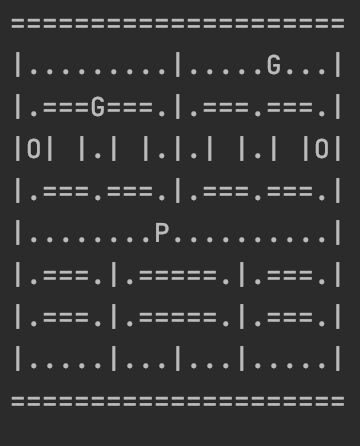

# Project

## Project rules

- **Find a colleague to work with!**
- Choose and share your idea in the class' Slack channel before 25.11
- You are working on the project until the end of the course
- Try to use what we learnt during the course
- You are free to use something that was not covered during the course
- The following ideas are meant as inspiration: you can use them, but why not coming up with your own?
- **Find a colleague to work with!**

## Project ideas

### Text analysis

#### Description:

Users enter text using the console. The application calculates statistics and show them to the user:

- amount of sentences
- amount of words
- the longest word
- the longest sentence
- top 5 most popular words in the text

#### Bonus:

If this is too simple, here some ideas how you can make the project more complex, potentially using more tools too:

- Read text from a file instead of from the console
- Application receives a path to a folder, checks all files in this folder and create a statistics as a json file for
  each file + a statistics for the folder, that contains:
    - How many files were processed
    - The longest text
    - The shortest text
    - The longest sentence
    - The longest word
    - The top 5 the most popular words across all the texts
- Read text from a web URL, or from an API (Twitter?)
- Add tests for your application

### Book Library

#### Description:

Build an application that allows us to catalogue and organize the books we lend to our users.

- Every book has an ISBN
- Using the ISBN we should be able to retrieve the details of the book from a public API e.g.
    - https://isbndb.com/
    - https://openlibrary.org/dev/docs/api/books
- We must be able to register a new book to the library. Note that we can have multiple copies of the same book.
- We must be able to remove a book from the store.
- Our users must be able to register at our library for a fee of 50 euros and when they do, they receive a library card.
- Users can visit the library to borrow one or multiple books for 1 euro each which is immediately withdrawn from the
  library card.
- The user cannot borrow a book if there is no money in the card.
- The user can then recharge the library card with more money.
- Every borrowed book must be returned after a week.
- Late returns are charged 10 cents for every day after the return period.
- The user can request to see their activity history.

### Phone Index

#### Description:

Using an interactive program operating through the console users should be able to

- save a new contact
    - First name
    - Last name
    - Phone numbers and label e.g. work, mobile, personal, private
    - addresses and label
    - additional information
- list all saved contact and their info
- modify existing contact
- delete existing contact
- search for contacts by name or phone number

#### Bonus:

If this is too simple, here some ideas how you can make the project more complex, potentially using more tools too:

- save contacts to file
- load contacts from a previously saved file
- generate a [QR Code](https://fileinfo.com/extension/vcf) for a contact.
- generate a [VCF file](https://fileinfo.com/extension/vcf) for a contact.
- generate a [CSV file](https://fileinfo.com/extension/csv) for all contacts.

### Accounting software

#### Description:

Users should be able to:

- add expenses and earnings through the console
- retrieve all previously inserted expenses and earnings
- receive summaries and balances

#### Bonus:

If this is too simple, here some ideas how you can make the project more complex, potentially using more tools too:

- save and load data to and from file, to use it later on
- have a simple user management system that allows different users to register and log in the system, and store their
  data in different files
- use a real db!

### Twitter analysis

#### Description:

A lot of things are said on Twitter every day - the analysis of tweets can be very valuable!
The user of your program should be able to select a tag/topic, anx the program could fetch the last tweets on the topic
and return some basic statistics

- most mentioned words (removing very common words?)
- most used emojis
- most active user

#### Bonus:

If this is too simple, here some ideas how you can make the project more complex, potentially using more tools too:

- you could use a graphing library to actually output nice graphs!

### Exercice Tracker (with persistence)

#### Description:

Users should be able to:

- select from a static list of possible exercises and enter when they did it & specific exercice-relevant information,
  e.g.
    - for runnning and biking: Duration & Distance
    - for weightlifting exercices: Weight & Repetitions
    - for football, basketball, ... : Duration, # of matches played
- get an easily readable list of exercices they did in the last x days/weeks/months
- The data they entered should not be lost when the appliction is closed - either with a database or a file-based
  storage.

#### Bonus:

If this is too simple, here some ideas how you can make the project more complex, potentially using more tools too:

- keeping track of the data of multiple users in parallel
- allowing the user to put in their weight and keep track of their weight change over the last x days/weeks/months
- calculating the calories burned whenever someone enters an exercice based on the exercice type, the provided details &
  the persons weight.

### Pacman console version

#### Description

In this project we would like to create a simple version of the famous game Pacman. You will have a 20 by 27 maze (you
can freely choose a different one than the original game), the maze contains dots, large flashing dots, ghosts and
pacmac itself. For this simple version the game will be turn based, so each time you will get a prompt in the console to
choose in which direction pacman will go, of course the ghost move randomly, on each turn you move by one case only.
Game rule:

- Pacman has 3 life point, when pacman reach 0 life the game ends.
- Pacman has 2 state:
    - Defensive: pacman is eaten by the ghost.
    - Offensive: pacman can eat the ghost
- Pacman by default is in defensive state, only when he eats the large flashing dot he is an offensive state. The
  offensive state ends after 15 moves.
- When pacman is in defensive state and he is in the same case as a ghost, pacman dies, lose a life, los and go back to
  the initial case, the ghosts too return to the initial case.
- When pacman is in offensive state and he is in the same case as a ghost, he kills the ghost, the ghost goes back to
  the initial case. When pacman eats a ghost you can +100 in the score.
- When eating any type of dots, you get +5 in the score.
- If pacman manage to eat all the dots, the game end and pacman win.

PS: you can show the maze in the console as in the image below. G is for ghosts, P for pacman, O for large dots, . for
dots the others are obstacles.

#### Bonus

1. Add a leaderboard system, you can use files to save old scores.
2. Use a UI library to render the maze and the different characters in the game. You can use `libgdx` or search for
   a `Java 2d games library`.
3. Change the game to no be turn based but more dynamic as the original pacman game. (This is a tricky one)

### Groceries Delivery

Users should be able to (through the terminal):

- lookup for different product in different groups (bread, dairy, meat, fish, vegan)
- choose what products they want to deliver and how much
- see the order, before the confirmation
- confirm the order

#### Bonus:

If this is too simple, here some ideas how you can make the project more complex, potentially using more tools too:

- Read products and groups of the products from a file
- Use a db or a file to save all orders
- User should be able to:
    - see previous orders of this user
    - see statistics how much they paid per month
    - see statistics what product was ordered the most for the user
- Super user (admin) should be able to
    - see all orders
    - see all users
    - see the most popular product
    - change any product price
- Add support for the distribution centers (so some product could be out of stock after the orders)
- Add tests for your application

### CV generator

Users should be able to:

- add personal details
- add contact details
- add a link to a photo
- generate a pdf version of the CV based on the entered data

#### Hint

- A library for pdf generation:
- https://www.baeldung.com/java-pdf-creation
- https://www.dunebook.com/best-java-pdf-generation-libraries/

### Instagram API
Use the instagram API to make something cool, for example:

Users should be able to enter a hashtag and get a list of accounts they can follow that use that hashtag.

The details of how you select these accounts is up to you - there's different ways with different levels of difficulty:
- Easy: Take the first 10 accounts you find that use that hashtag
- Medium: Recommend accounts first that have the most posts/followers/...
- Hard: Let the user select what's most important to them (follower #, post count, recently active, ...) 

**Note: An important part of this task will be reading the Instagram API documentation and understanding how to interact with it.**

### Spotify API

Use the spotify API to do something cool, for example:
User should be able to enter an artist and get 10 song recommendations

The details of how you select these songs is up to you - there's different ways with different levels of difficulty:
- Easy: Take the 10 most streaed songs of that artist
- Medium: Let the user pick an album, pick songs from that album first
- Hard: Mix in songs from similar artists

**Note: An important part of this task will be reading the Spotify API documentation and understanding how to interact with it.**

### Image Analysis

Java provides libraries to analyze images. You can do something cool with that, like:

Easy: User should be able to provide the path to a local image and the application prints the most dominant colors in that image
Medium: User should be able to provide the path to a folder with images and the user can search for colors. The application lists the images that use that color a lot.
Hard: After performing image analysis, store the information per image locally. Allow the user to add custom tags on top of the automatic color analysis. Provide the User the ability to search the folder based on tags. Tags should not be lost when the application restarts!
